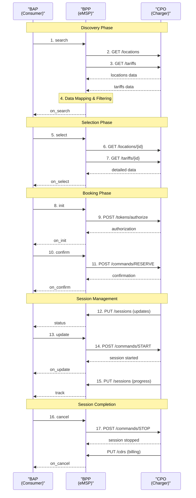

# RFC: Beckn Protocol Implementation for EV Charging

**RFC Number:** BECKN-EV-001  
**Category:** Informational  
**Status:** Draft  
**Version:** 0.1.0  
**Date:** 2025-08-29  
**Updated:** 2025-08-29  
**Authors:** Beckn Protocol EV Charging Working Group  
**Reviewers:** Ravi Prakash, Sujith Nair  
**Supersedes:** None  
**Keywords:** Beckn Protocol, EV Charging, OCPI, eMSP, CPO, BAP, BPP  

## Copyright Notice
Copyright (c) 2025 Beckn Protocol Foundation. All rights reserved.

## Status of This Memo
This is a draft RFC for implementing EV charging using the Beckn Protocol. It provides implementation guidance for network participants to build EV charging applications that integrate with the Beckn network while maintaining compatibility with OCPI standards for CPO communication.

## Abstract

This RFC presents a paradigm shift in electric vehicle charging accessibility by leveraging the Beckn Protocol's distributed commerce architecture to create a **unified marketplace for EV charging services**. Rather than forcing consumers to manage multiple charging network apps and accounts, this approach enables seamless discovery and booking of charging sessions across any participating Charge Point Operator (CPO) through a single consumer interface.

The architecture transforms EV charging from fragmented network silos to an interoperable ecosystem where consumers can find, compare, and book charging sessions at any participating station regardless of the underlying CPO. This marketplace-driven approach addresses the key barriers to EV adoption—charging anxiety, network fragmentation, and payment complexity—through standardized discovery, transparent pricing, and unified booking across the entire charging infrastructure landscape.

By combining Beckn Protocol's commerce capabilities with OCPI's technical interoperability, this implementation enables e-Mobility Service Providers (eMSPs) to aggregate charging services from multiple CPOs while providing consumers with a consistent, app-agnostic charging experience. The result is a scalable, future-proof foundation for the mass adoption of electric vehicles.

## Table of Contents

1. [Introduction](#1-introduction)
2. [Conventions and Terminology](#2-conventions-and-terminology)
3. [Background and Context](#3-background-and-context)
4. [Architecture Overview](#4-architecture-overview)
5. [Implementation Guide](#5-implementation-guide)
6. [Message Flows](#6-message-flows)
7. [API Specifications](#7-api-specifications)
8. [Best Practices](#8-best-practices)
9. [Examples](#9-examples)
10. [References](#10-references)
11. [Appendix](#11-appendix)

## 1. Introduction

### 1.1 Purpose

This RFC provides comprehensive implementation guidance for deploying EV charging services using the Beckn Protocol ecosystem. It specifically addresses how consumer applications can provide unified access to charging infrastructure across multiple Charge Point Operators while maintaining technical compatibility with existing OCPI-based systems.

### 1.2 Scope

This document covers:
- **Architecture patterns** for EV charging marketplace implementation using Beckn Protocol
- **Discovery and booking mechanisms** for charging sessions across multiple CPOs
- **Real-time availability and pricing** integration with OCPI-based systems
- **Session management and billing** coordination between Beckn and OCPI protocols
- **Security and authentication** considerations for multi-party charging transactions
- **Integration patterns** with existing eMSP and CPO systems
- **Performance optimization** strategies for real-time charging operations

This document does not cover:
- **Detailed OCPI protocol specifications** (refer to OCPI 2.2.1 documentation)
- **Physical charging infrastructure** requirements and standards
- **Regulatory compliance** beyond technical implementation (varies by jurisdiction)
- **Payment processor integration** specifics (implementation-dependent)
- **Smart grid integration** and load management systems

### 1.3 Target Audience

- **Consumer Application Developers (BAP)**: Building EV driver-facing charging applications with unified cross-network access
- **e-Mobility Service Providers (eMSP/BPP)**: Implementing charging service aggregation platforms across multiple CPO networks
- **Charge Point Operators (CPO)**: Understanding integration requirements for Beckn-enabled marketplace participation
- **Technology Integrators**: Building bridges between existing OCPI infrastructure and new Beckn-based marketplaces
- **System Architects**: Designing scalable, interoperable EV charging ecosystems
- **Business Stakeholders**: Understanding technical capabilities and implementation requirements for EV charging marketplace strategies
- **Standards Organizations**: Evaluating interoperability approaches for future EV charging standards development

### 1.4 Prerequisites

Readers should have:
- **Basic understanding of Beckn Protocol concepts and APIs**
  - [Beckn Protocol Specification v1.1.0](https://github.com/beckn/protocol-specifications)
  - [Beckn Protocol Developer Documentation](https://developers.becknprotocol.io/)
  - [Generic Implementation Guide](https://github.com/beckn/missions/blob/main/Generic-Implementation-Guide/generic_implementation_guide.md)
- **Knowledge of EV charging ecosystem and operations**
  - [Electric Vehicle Supply Equipment (EVSE) Standards](https://www.iec.ch/)
  - [EV Charging Infrastructure Overview](https://www.iea.org/reports/global-ev-outlook-2024)
  - [Charging Session Management Best Practices](https://www.iso.org/standard/71565.html)
- **Familiarity with OCPI protocol and EV charging interoperability**
  - [OCPI 2.2.1 Specification](https://evroaming.org/app/uploads/2020/06/OCPI-2.2.1.pdf)
  - [EV Roaming and Interoperability](https://evroaming.org/)
  - [eMSP and CPO Integration Patterns](https://www.cen.eu/work/areas/transport/evehicles/pages/default.aspx)
- **Technical proficiency in REST APIs and distributed systems**
  - [JSON Schema Specification](https://json-schema.org/)
  - [RESTful API Design Guidelines](https://restfulapi.net/)
  - [OpenAPI Specification](https://swagger.io/specification/)
  - [Microservices Architecture Patterns](https://microservices.io/)

## 2. Conventions and Terminology

### 2.1 Keywords

The key words "MUST", "MUST NOT", "REQUIRED", "SHALL", "SHALL NOT", "SHOULD", "SHOULD NOT", "RECOMMENDED", "MAY", and "OPTIONAL" in this document are to be interpreted as described in RFC 2119.

### 2.2 Terminology

- **BAP (Beckn App Platform)**: Consumer-facing application that initiates transactions
- **BPP (Beckn Provider Platform)**: Service provider platform that responds to BAP requests
- **eMSP (e-Mobility Service Provider)**: Service provider that aggregates multiple CPOs
- **CPO (Charge Point Operator)**: Entity that owns and operates charging infrastructure
- **EVSE (Electric Vehicle Supply Equipment)**: Individual charging station unit
- **OCPI (Open Charge Point Interface)**: Protocol for communication between eMSPs and CPOs

## 3. Background and Context

### 3.1 Problem Domain

**The EV Charging Ecosystem's Critical Fragmentation Crisis**

The global electric vehicle charging infrastructure faces an unprecedented complexity challenge that threatens to become the primary barrier to mass EV adoption. Unlike traditional fuel stations that operate under relatively uniform standards, the EV charging landscape has evolved as a collection of incompatible, proprietary networks that create significant friction for consumers and inefficiencies for the entire ecosystem.

**The Multi-Network App Nightmare**

EV drivers today face a bewildering array of charging network applications, each requiring separate registration, payment methods, and user accounts. A typical EV driver in a major metropolitan area might need 5-10 different charging apps to access all available charging stations:

**Tesla Supercharger Network**: Requires Tesla account, limited to Tesla vehicles (though opening to other brands)
**ChargePoint**: Largest network in North America with proprietary app and payment system
**Electrify America**: Volkswagen-backed network with dedicated mobile application
**EVgo**: Fast-charging network with unique membership and pricing structure
**Local Utility Networks**: Municipal and regional charging networks with localized apps and payment systems

Each network operates with different pricing structures, availability reporting mechanisms, reservation policies, and payment methods. A driver planning a long-distance trip must manually check multiple apps, create multiple accounts, and carry multiple RFID cards or maintain multiple mobile app logins.

**The Technical Interoperability Void**

While the OCPI (Open Charge Point Interface) protocol has emerged as a technical standard for communication between eMSPs and CPOs, consumer-facing applications remain fragmented. OCPI solves backend interoperability but doesn't address the consumer experience layer:

**Backend Connectivity**: CPOs can share location and pricing data with eMSPs through OCPI
**Authorization Complexity**: Each eMSP maintains separate customer accounts and payment relationships
**Session Management**: Real-time charging session coordination requires complex multi-party integration
**Data Synchronization**: Availability status, pricing updates, and reservation management operate in silos

**The Economic Inefficiency Cascade**

This fragmentation creates compounding economic inefficiencies throughout the ecosystem:

**For Consumers**: Higher transaction costs due to multiple account fees, inability to comparison shop effectively, range anxiety due to uncertain charging access
**For CPOs**: Reduced utilization due to limited customer reach, higher customer acquisition costs, complex integration requirements with multiple eMSPs
**For eMSPs**: Limited value proposition due to incomplete network coverage, complex technical integrations, difficulty in providing unified customer experience

**The Scale Challenge**

The problem is accelerating as EV adoption grows exponentially. Current projections show:
- **50 million EVs** expected globally by 2030
- **10 million charging points** needed to support this growth
- **Hundreds of CPOs** operating across different regions and standards
- **Complex roaming agreements** required between every pair of networks

Without standardized consumer-facing interoperability, this growth will create an increasingly complex web of incompatible systems that could significantly slow EV adoption rates.

**The Mobility-as-a-Service Vision Gap**

The transportation industry is moving toward integrated mobility solutions where consumers access various transportation modes through unified interfaces. EV charging's fragmentation creates a critical gap in this vision:

**Multi-Modal Integration**: Ride-sharing, public transit, and personal vehicle charging cannot be seamlessly coordinated
**Smart City Initiatives**: Urban planning and traffic management systems cannot effectively integrate with fragmented charging networks
**Fleet Management**: Commercial and ride-sharing fleets face operational complexity managing multiple charging relationships

### 3.2 Current State

Currently, EV charging is implemented through:
- **Direct CPO Apps**: Limited to specific charging networks
- **Aggregator Apps**: Limited integration capabilities
- **OCPI Protocol**: Standard for eMSP-CPO communication but lacks consumer interface

### 3.3 Motivation

The Beckn Protocol provides:
- **Unified Consumer Experience**: Single app for multiple charging networks
- **Standardized Communication**: Consistent API patterns across the network
- **Network Effects**: Value increases with more participants
- **Open Standards**: Vendor-neutral implementation approach

## 4. Architecture Overview

### 4.1 System Components


### 4.2 Detailed Data Flow




## 5. Implementation Guide

### 5.1 Overview

**Beckn Protocol as the Foundation for EV Charging Marketplace Communication**

This implementation guide demonstrates how to harness the **Beckn open source protocol** as the unified communication backbone for EV charging marketplace operations. We leverage Beckn's proven distributed commerce architecture to create seamless interactions between consumers, eMSPs, and the broader charging infrastructure ecosystem.

The Beckn Protocol serves as our **digital lingua franca**, enabling standardized communication for:
- **Charging station discovery and comparison**: Consumers searching for available charging stations across multiple CPO networks with real-time availability and pricing
- **Session booking and management**: Unified reservation, authorization, and payment coordination across diverse charging infrastructure
- **Real-time session monitoring**: Live status updates, session control, and completion notifications through standardized API conversations
- **Multi-party billing and settlement**: Transparent cost calculation and payment processing across eMSP-CPO relationships
- **Cross-network roaming**: Seamless charging access for consumers traveling across different geographic regions and charging networks

This approach transforms complex multi-party charging transactions into **standardized API conversations** that any participant can understand and implement, whether they're managing a single consumer mobile app or coordinating charging access across hundreds of CPO networks.

**Implementation Architecture: Four-Phase Marketplace Orchestration**

An implementation follows a **DOFP (Discovery, Order, Fulfillment, Post-fulfillment) marketplace approach** where each phase builds upon standardized Beckn API interactions:

1. **Discovery Phase**: Consumers discover available charging stations through search APIs, finding real-time availability and pricing across multiple CPO networks
2. **Order Phase**: Detailed charging station selection and booking using select/init/confirm APIs, establishing charging session commitments with integrated OCPI coordination
3. **Fulfillment Phase**: Real-time session management via update/status/track APIs, enabling charging session control and monitoring
4. **Post-fulfillment Phase**: Session completion, billing coordination, and support interactions through status/support/rating APIs, ensuring transparent cost calculation and payment processing

Each phase leverages **native Beckn Protocol capabilities**—search, select, init, confirm, status, update, support, cancel, rating—adapted specifically for the EV charging domain while maintaining full protocol compliance and interoperability.

### 5.2 Prerequisites

Before implementation, the following infrastructure must be in place:

**For Consumer Applications (BAP):**
- **User Authentication System**: Account management, profile storage, and secure session handling for EV drivers
- **Vehicle Profile Management**: EV specifications (connector types, battery capacity, charging speeds) for compatibility matching
- **Location Services**: GPS functionality, maps integration, and route planning capabilities for charging station discovery
- **Payment Integration**: Payment method storage, transaction processing, and billing history management
- **Communication Infrastructure**: Push notification systems, real-time messaging, and offline capability for charging session management

**For e-Mobility Service Providers (eMSP/BPP):**
- **OCPI Client Infrastructure**: Full OCPI 2.2.1 implementation for communication with multiple CPOs including credential management, webhook handling, and real-time data synchronization
- **Data Aggregation Systems**: Real-time location and tariff data collection, normalization, and caching from multiple CPO sources
- **Session Management**: Authorization token management, reservation coordination, session monitoring, and billing calculation engines
- **Customer Management**: User account systems, payment processing, customer support, and subscription management
- **Business Intelligence**: Analytics, reporting, performance monitoring, and demand forecasting for charging operations

**For System Integration:**
- **Network Infrastructure**: High-availability API endpoints, load balancing, message queuing, and failover capabilities
- **Security Infrastructure**: Digital signature capabilities, certificate management, API authentication, and data encryption systems
- **Monitoring and Observability**: Real-time monitoring, alerting, logging, and performance tracking across all system components

### 5.3 Configuration

#### 5.3.1 Network Architecture Setup

**The Distributed Intelligence Paradigm for EV Charging**

EV charging marketplace fundamentally reimagines charging infrastructure access as a **distributed intelligence network** rather than centralized, proprietary command-and-control systems. Each participant—whether consumer, eMSP, or CPO—operates as an autonomous agent capable of making intelligent decisions while coordinating with the broader charging ecosystem.

**Consumer Application (BAP) - The Intelligent Mobility Node:**

Each consumer application operates as a smart mobility edge node that seamlessly bridges user needs with the charging marketplace. The BAP handles Beckn Protocol communications with eMSPs, makes intelligent charging decisions based on vehicle requirements (battery capacity, connector compatibility), journey planning (route optimization, charging time constraints), economic preferences (pricing comparison, payment methods), and user preferences (charging speed, amenities, accessibility), while integrating with vehicle systems to translate consumer needs into marketplace transactions.

**e-Mobility Service Provider (BPP) - The Marketplace Orchestrator:**

The eMSP operates as an intelligent charging marketplace operator that aggregates multiple CPO networks into a unified service offering. The BPP interfaces with CPO systems via OCPI 2.2.1 protocol for location management, tariff synchronization, and session coordination, orchestrates marketplace operations including real-time availability monitoring, consumer preference tracking, pricing optimization, and revenue sharing calculations, while handling all Beckn Protocol communications with consumer BAPs for search queries, bookings, and status tracking.

**Gateway Service:**
Discovery requests flow through gateways (Beckn Gateway) that broadcast search queries to all relevant charging service providers in the network. Gateways filter and route messages based on domain and geographic criteria.

**Registry Service:**
Each EV charging network requires a registry where all participants (BAP, BPP, BG) register themselves with details such as network endpoint, domains, region of operation, public keys. The registry maintains the authoritative list of network participants and their subscription status.

#### 5.3.2 Security and Communication Infrastructure

**Security Infrastructure:**
- **Multi-layer Authentication**: Digital signatures for API calls, OAuth 2.0 for user authentication, PKI for inter-system communication
- **Data Protection**: End-to-end encryption for payment data, GDPR-compliant user data handling, secure token management
- **Network Security**: API rate limiting, DDoS protection, intrusion detection, secure communication channels
- **Compliance Framework**: PCI DSS for payment processing, regional data protection regulations, charging industry standards

**Communication Infrastructure:**
- **High-Availability Architecture**: Multi-region deployment, load balancing, database replication, disaster recovery procedures
- **Real-time Processing**: WebSocket connections for live updates, message queuing for async operations, event-driven architecture
- **Integration APIs**: RESTful services for system integration, webhook handling for real-time notifications, batch processing for large data updates
- **Monitoring and Alerting**: Real-time system monitoring, performance metrics collection, automated incident response, capacity planning

#### 5.3.3 Implementation Components

**Step 1: BAP Implementation**

**Input:** Beckn Protocol specification, consumer requirements
**Output:** Consumer application with search and booking capabilities

**Core Components:**

**Consumer Application (BAP) Components:**
- **Search Interface**: Location-based charging station discovery with filtering capabilities
- **Selection Interface**: Detailed station information and booking decision support
- **Booking Management**: Session reservation and payment processing
- **Session Tracking**: Real-time charging session monitoring and control
- **User Profile**: Vehicle specifications and preferences management

**Step 2: BPP Implementation (eMSP)**

**e-Mobility Service Provider (BPP) Components:**
- **Beckn Protocol Handler**: Processes BAP requests and generates appropriate responses
- **OCPI Client Integration**: Communicates with multiple CPO networks for real-time data
- **Data Aggregation Engine**: Combines location and tariff data from multiple sources
- **Session Management**: Coordinates booking, authorization, and session lifecycle
- **Settlement Processing**: Handles billing calculation and multi-party payments

**Step 3: Advanced OCPI Integration**

**OCPI Integration Components:**
- **CPO Registration**: Automated handshake and credential exchange with multiple CPO networks
- **Real-time Data Synchronization**: Continuous location and tariff updates via push/pull mechanisms
- **Token Management**: Driver authentication and authorization across CPO networks
- **Command Coordination**: Session management commands (reserve, start, stop) via OCPI
- **Error Resilience**: Circuit breaker patterns and fallback strategies for CPO failures

### 5.4 Step-by-Step Implementation

#### 5.4.1 Step 1: Discovery Phase - Charging Station Discovery

**The Consumer's Journey: From Range Anxiety to Charging Confidence**

This step represents the fundamental transformation of EV charging from "hoping to find an available station" to "confidently discovering the best charging option." Unlike traditional fuel stations with relatively uniform availability, EV charging requires real-time coordination across multiple networks with varying availability, pricing, and technical compatibility.

**Process:**
- **Intelligent Search Initiation**: Consumer application sends location-based search request including vehicle specifications, range requirements, and timing constraints
- **Multi-Network Aggregation**: Gateway broadcasts the search to all relevant eMSPs in the charging network marketplace
- **Real-time Data Synthesis**: eMSPs query multiple CPO networks via OCPI, collecting current availability, pricing, and technical specifications
- **Comprehensive Response Assembly**: eMSPs respond with unified charging station catalog including cross-network options with real-time availability status

**Key Information Exchanged:**
- **Location and Range Parameters**: Current location, destination, acceptable detour distance, urgency level, and backup location preferences
- **Vehicle Compatibility Requirements**: Connector types (CCS, CHAdeMO, Type 2), charging speed capabilities, battery capacity, current state of charge
- **Consumer Preferences**: Pricing tolerance, amenity requirements (restaurants, restrooms, shopping), accessibility needs, brand preferences
- **Real-time Availability**: Current EVSE status, estimated availability windows, queue information, reservation options
- **Comprehensive Pricing**: Energy rates, time-based fees, membership discounts, dynamic pricing, total session cost estimates

#### 5.4.2 Step 2: Order Phase - Charging Station Selection and Booking

**The Decision Point: Informed Choice and Commitment**

This step enables consumers to make informed decisions and commit to charging sessions through comprehensive technical and commercial evaluation, followed by booking authorization and payment coordination.

**Process:**
- **Detailed Station Inquiry**: Consumer selects specific charging station from discovery results for comprehensive information
- **Real-time Status Verification**: eMSP performs targeted OCPI calls to verify current status, pricing, and technical specifications
- **Comprehensive Information Assembly**: eMSP provides detailed station information including amenities, access instructions, and current conditions
- **Booking Authorization**: Consumer commits to specific charging session with time window and payment authorization
- **Multi-system Coordination**: eMSP simultaneously processes Beckn booking confirmation and OCPI session authorization
- **Binding Reservation Creation**: Successful coordination results in confirmed charging session reservation with guaranteed access

**Key Information Exchanged:**
- **Technical Specifications**: Exact connector types, maximum charging speeds, power delivery profiles, compatibility confirmations
- **Current Operational Status**: Real-time EVSE availability, estimated charging duration, queue status, maintenance notifications
- **Comprehensive Pricing**: Detailed rate structure, estimated total costs, membership benefits, payment options, cancellation policies
- **Location Intelligence**: Precise directions, access instructions, parking availability, security information, operating hours
- **Amenity Information**: Available services (restaurants, restrooms, shopping), WiFi access, accessibility features, customer reviews
- **Session Parameters**: Specific EVSE reservation, planned charging duration, arrival time estimates, vehicle identification
- **Authorization Credentials**: Consumer charging tokens, payment method confirmation, membership verification, access codes
- **Reservation Confirmation**: Guaranteed access window, pricing lock-in, cancellation terms, emergency contact procedures

#### 5.4.3 Step 3: Fulfillment Phase - Real-time Session Management

**The Experience: Seamless Charging Execution**

This step manages the active charging session, providing real-time monitoring and control capabilities while coordinating between Beckn consumer interfaces and OCPI charging infrastructure.

**Process:**
- **Session Initiation Coordination**: Consumer arrives at station, initiates charging, and eMSP coordinates authorization through OCPI protocols
- **Real-time Monitoring**: Continuous session status tracking, charging progress monitoring, and anomaly detection across integrated systems
- **Dynamic Session Management**: Real-time session control, duration adjustments, emergency stop capabilities, and extension coordination
- **Proactive Communication**: Automated status updates, completion notifications, and issue resolution through integrated messaging systems

**Key Information Exchanged:**
- **Live Session Status**: Current charging power, energy delivered, estimated completion time, battery status, cost accumulation
- **Session Control Commands**: Charging rate adjustments, session pause/resume, early termination, extension requests, emergency stops
- **Real-time Coordination**: OCPI session management commands, charging infrastructure status, grid integration signals, load balancing coordination
- **Consumer Experience**: Mobile app real-time updates, push notifications, station amenity information, support access, feedback collection
- **Operational Intelligence**: Performance metrics, infrastructure utilization, demand patterns, quality monitoring, optimization opportunities

#### 5.4.4 Step 4: Post-fulfillment Phase - Session Completion and Support

**The Resolution: Transparent Billing and Experience Closure**

This step handles charging session completion, accurate billing calculation, consumer experience closure, and ongoing support while coordinating settlement across eMSP-CPO financial relationships.

**Process:**
- **Session Completion Coordination**: Charging session ends (automatically or by consumer request), final energy delivery measurement, equipment status verification
- **Multi-party Billing Calculation**: eMSP coordinates final billing through OCPI protocols while processing Beckn marketplace settlement
- **Payment Processing and Settlement**: Consumer payment processing, eMSP-CPO financial settlement, transaction reconciliation, receipt generation
- **Experience Completion**: Final session summary, feedback collection, loyalty program updates, future recommendation optimization
- **Support and Rating**: Customer support interactions, session rating collection, issue resolution, and continuous service improvement

**Key Information Exchanged:**
- **Final Session Metrics**: Total energy delivered, session duration, charging efficiency, infrastructure performance, environmental impact
- **Comprehensive Billing**: Energy costs, time-based fees, taxes, discounts applied, payment method charges, total session cost
- **Settlement Coordination**: eMSP-CPO revenue sharing, OCPI CDR (Charging Data Record) processing, financial reconciliation, audit trail creation
- **Consumer Experience Data**: Session satisfaction ratings, performance feedback, preference updates, loyalty program benefits, future recommendations
- **Operational Analytics**: Network performance metrics, utilization patterns, consumer behavior insights, infrastructure optimization data, market intelligence
- **Support Interactions**: Customer service requests, technical support coordination, complaint resolution, and quality improvement feedback

### 5.5 Testing

#### 5.5.1 Test Scenarios

Key validation scenarios for EV charging marketplace implementation:

1. **Multi-Network Discovery Test**
   - **Test Case**: Search for charging stations across multiple CPO networks with various filters
   - **Expected Result**: Comprehensive results from all available networks with accurate real-time data

2. **Vehicle Compatibility Validation Test**
   - **Test Case**: Search with specific vehicle connector and charging speed requirements
   - **Expected Result**: Only compatible charging stations returned with accurate technical specifications

3. **Real-time Availability Synchronization Test**
   - **Test Case**: Verify availability status consistency between Beckn marketplace and OCPI infrastructure
   - **Expected Result**: Accurate real-time status with automatic updates during availability changes

4. **Cross-Protocol Session Management Test**
   - **Test Case**: Complete charging session flow with Beckn booking and OCPI session execution
   - **Expected Result**: Seamless session execution with accurate status tracking and billing

5. **Multi-party Settlement Verification Test**
   - **Test Case**: Verify accurate billing calculation and settlement across eMSP-CPO relationships
   - **Expected Result**: Accurate cost calculation, transparent billing, and correct revenue sharing

#### 5.5.2 Validation Checklist

- [ ] Multi-network search returns comprehensive results within timeout limits
- [ ] Vehicle compatibility filtering works accurately for all supported connector types
- [ ] Real-time availability status updates automatically across all interfaces
- [ ] OCPI integration maintains session state consistency with Beckn transactions
- [ ] Payment processing handles multi-party settlement correctly
- [ ] Error handling gracefully manages CPO network failures
- [ ] Security protocols protect consumer and payment data throughout all transactions
- [ ] Performance meets real-time requirements for charging session operations

## 6. Implementation Examples

This section provides comprehensive examples of all Beckn Protocol messages used in EV charging implementations, sourced from the UEI Implementation Guide. These examples demonstrate the complete flow from discovery to fulfillment with real-world message structures.

### 6.1 Discovery Examples

#### 6.1.1 Search Request

**Description:** Consumer searches for EV charging stations with specific criteria including location, connector type, and category filters.

**Search Criteria:**
- Location search around GPS coordinates with radius
- Connector type filtering (e.g., CCS2)
- Category-based search (e.g., green-tariff)
- Free text search capability

```json
{
  "context": {
    "ttl": "PT10M",
    "action": "search",
    "location": {
      "country": {
        "name": "India",
        "code": "IND"
      },
      "city": {
        "code": "std:080"
      }
    },
    "timestamp": "2024-08-05T09:21:12.618Z",
    "message_id": "e138f204-ec0b-415d-9c9a-7b5bafe10bfe",
    "transaction_id": "2ad735b9-e190-457f-98e5-9702fd895996",
    "domain": "ev-charging:uei",
    "version": "1.1.0",
    "bap_id": "example-bap-id",
    "bap_uri": "https://example-bap-url.com"
  },
  "message": {
    "intent": {
      "descriptor": {
        "name": "EV charger"
      },
      "category": {
        "descriptor": {
          "code": "green-tariff"
        }
      },
      "fulfillment": {
        "type": "CHARGING",
        "stops": [
          {
            "location": {
              "circle": {
                "gps": "12.423423,77.325647",
                "radius": {
                  "value": "5",
                  "unit": "km"
                }
              }
            }
          }
        ],
        "tags": [
          {
            "list": [
              {
                "descriptor": {
                  "code": "connector-type"
                },
                "value": "CCS2"
              }
            ]
          }
        ]
      }
    }
  }
}
```

#### 6.1.2 On Search Response

**Description:** BPP returns comprehensive catalog of available charging stations from multiple CPOs with detailed specifications, pricing, and location information.

**Response Structure:**
- Multiple providers (CPOs) with their charging networks
- Detailed location information with GPS coordinates
- Individual charging station specifications and pricing
- Connector types, power ratings, and availability status

```json
{
  "context": {
    "domain": "ev-charging:uei",
    "action": "on_search",
    "location": {
      "country": {
        "name": "India",
        "code": "IND"
      },
      "city": {
        "code": "std:080"
      }
    },
    "version": "1.1.0",
    "bap_id": "example-bap.com",
    "bap_uri": "https://api.example-bap.com/pilot/bap/energy/v1",
    "bpp_id": "example-bpp.com",
    "bpp_uri": "https://example-bpp.com",
    "transaction_id": "6743e9e2-4fb5-487c-92b7-13ba8018f176",
    "message_id": "6743e9e2-4fb5-487c-92b7-13ba8018f176",
    "timestamp": "2023-07-16T04:41:16Z"
  },
  "message": {
    "catalog": {
      "providers": [
        {
          "id": "cpo1.com",
          "descriptor": {
            "name": "CPO1 EV charging Company",
            "short_desc": "CPO1 provides EV charging facility across India",
            "images": [
              {
                "url": "https://cpo1.com/images/logo.png"
              }
            ]
          },
          "categories": [
            {
              "id": "category-gt",
              "descriptor": {
                "code": "green-tariff",
                "name": "green tariff"
              }
            }
          ],
          "locations": [
            {
              "id": "LOC-DELHI-001",
              "gps": "28.345345,77.389754",
              "descriptor": {
                "name": "BlueCharge Connaught Place Station"
              },
              "address": "Connaught Place, New Delhi"
            },
            {
              "id": "LOC-DELHI-002",
              "gps": "28.247934,77.876987",
              "descriptor": {
                "name": "BlueCharge Saket Station"
              },
              "address": "824 Saket, New Delhi"
            }
          ],
          "fulfillments": [
            {
              "id": "fulfillment-001",
              "type": "CHARGING",
              "stops": [
                {
                  "location": {
                    "gps": "28.6304,77.2177",
                    "address": {
                      "full": "Connaught Place, New Delhi"
                    }
                  }
                }
              ]
            },
            {
              "id": "fulfillment-002",
              "type": "CHARGING",
              "stops": [
                {
                  "location": {
                    "gps": "28.6310,77.2200",
                    "address": {
                      "full": "Saket, New Delhi"
                    }
                  }
                }
              ]
            }
          ],
          "items": [
            {
              "id": "pe-charging-01",
              "descriptor": {
                "name": "EV Charger #1 (AC Fast Charger)",
                "code": "energy"
              },
              "price": {
                "value": "18",
                "currency": "INR/kWH"
              },
              "fulfillment_ids": [
                "fulfillment-001"
              ],
              "category_ids": [
                "category-gt"
              ],
              "location_ids": [
                "LOC-DELHI-001"
              ],
              "tags": [
                {
                  "descriptor": {
                    "code": "connector-specifications",
                    "name": "Connector Specifications"
                  },
                  "list": [
                    {
                      "descriptor": {
                        "name": "connector Id",
                        "code": "connector-id"
                      },
                      "value": "con1"
                    },
                    {
                      "descriptor": {
                        "name": "Power Type",
                        "code": "power-type"
                      },
                      "value": "AC_3_PHASE"
                    },
                    {
                      "descriptor": {
                        "name": "Connector Type",
                        "code": "connector-type"
                      },
                      "value": "CCS2"
                    },
                    {
                      "descriptor": {
                        "name": "Charging Speed",
                        "code": "charging-speed"
                      },
                      "value": "FAST"
                    },
                    {
                      "descriptor": {
                        "name": "Power Rating",
                        "code": "power-rating"
                      },
                      "value": "30kW"
                    },
                    {
                      "descriptor": {
                        "name": "Status",
                        "code": "status"
                      },
                      "value": "Available"
                    }
                  ]
                }
              ]
            },
            {
              "id": "pe-charging-02",
              "descriptor": {
                "name": "EV Charger #2 (DC Fast Charger)",
                "code": "energy"
              },
              "price": {
                "value": "25",
                "currency": "INR/kWH"
              },
              "fulfillment_ids": [
                "fulfillment-002"
              ],
              "category_ids": [
                "category-gt"
              ],
              "location_ids": [
                "LOC-DELHI-002"
              ],
              "tags": [
                {
                  "descriptor": {
                    "name": "Connector Specifications"
                  },
                  "list": [
                    {
                      "descriptor": {
                        "name": "connector 1",
                        "code": "connector-id"
                      },
                      "value": "con4"
                    }
                  ]
                }
              ]
            }
          ]
        }
      ]
    }
  }
}
```

### 6.2 Order Management Examples

This section contains examples from the UEI Implementation Guide covering the complete order management flow from selection to confirmation.

#### 6.2.1 Select Request

**Description:** Consumer selects specific charging station from search results and requests detailed quote with timing information.

```json
{
  "context": {
    "domain": "ev-charging:uei",
    "action": "select",
    "location": {
      "country": {
        "name": "India",
        "code": "IND"
      },
      "city": {
        "code": "std:080"
      }
    },
    "version": "1.1.0",
    "bap_id": "example-bap.com",
    "bap_uri": "https://api.example-bap.com/pilot/bap/energy/v1",
    "bpp_id": "example-bpp.com",
    "bpp_uri": "https://example-bpp.com",
    "transaction_id": "6743e9e2-4fb5-487c-92b7-13ba8018f176",
    "message_id": "6743e9e2-4fb5-487c-92b7-13ba8018f176",
    "timestamp": "2023-07-16T04:41:16Z"
  },
  "message": {
    "order": {
      "provider": {
        "id": "cpo1.com"
      },
      "items": [
        {
          "id": "pe-charging-01"
        }
      ],
      "fulfillments": [
        {
          "id": "fulfillment-001",
          "stops": [
            {
              "type": "start",
              "time": {
                "timestamp": "2023-07-16T10:00:00+05:30"
              }
            },
            {
              "type": "finish",
              "time": {
                "timestamp": "2023-07-16T10:30:00+05:30"
              }
            }
          ]
        }
      ]
    }
  }
}
```

#### 6.2.2 On Select Response

**Description:** BPP returns detailed quote with pricing, terms, and service specifications for the selected charging station.

```json
{
  "context": {
    "domain": "ev-charging:uei",
    "action": "on_select",
    "location": {
      "country": {
        "name": "India",
        "code": "IND"
      },
      "city": {
        "code": "std:080"
      }
    },
    "version": "1.1.0",
    "bap_id": "example-bap.com",
    "bap_uri": "https://api.example-bap.com/pilot/bap/energy/v1",
    "bpp_id": "example-bpp.com",
    "bpp_uri": "https://example-bpp.com",
    "transaction_id": "6743e9e2-4fb5-487c-92b7-13ba8018f176",
    "message_id": "6743e9e2-4fb5-487c-92b7-13ba8018f176",
    "timestamp": "2023-07-16T04:41:16Z"
  },
  "message": {
    "order": {
      "provider": {
        "id": "cpo1.com",
        "descriptor": {
          "name": "CPO1 EV charging Company",
          "short_desc": "CPO1 provides EV charging facility across India",
          "images": [
            {
              "url": "https://cpo1.com/images/logo.png"
            }
          ]
        }
      },
      "items": [
        {
          "id": "pe-charging-01",
          "descriptor": {
            "name": "EV Charger #1 (AC Fast Charger)",
            "code": "energy"
          },
          "price": {
            "value": "18",
            "currency": "INR/kWH"
          },
          "tags": [
            {
              "descriptor": {
                "code": "connector-specifications",
                "name": "Connector Specifications"
              },
              "list": [
                {
                  "descriptor": {
                    "name": "connector Id",
                    "code": "connector-id"
                  },
                  "value": "con1"
                },
                {
                  "descriptor": {
                    "name": "Power Type",
                    "code": "power-type"
                  },
                  "value": "AC_3_PHASE"
                },
                {
                  "descriptor": {
                    "name": "Connector Type",
                    "code": "connector-type"
                  },
                  "value": "CCS2"
                },
                {
                  "descriptor": {
                    "name": "Charging Speed",
                    "code": "charging-speed"
                  },
                  "value": "FAST"
                },
                {
                  "descriptor": {
                    "name": "Power Rating",
                    "code": "power-rating"
                  },
                  "value": "30kW"
                },
                {
                  "descriptor": {
                    "name": "Status",
                    "code": "status"
                  },
                  "value": "Available"
                }
              ]
            }
          ]
        }
      ],
      "quote": {
        "price": {
          "currency": "INR",
          "value": "540"
        },
        "breakup": [
          {
            "title": "Charging Cost",
            "price": {
              "currency": "INR",
              "value": "540"
            }
          }
        ]
      }
    }
  }
}
```

#### 6.2.3 Init Request

**Description:** Consumer initiates order process with billing details and charging session requirements.

```json
{
  "context": {
    "domain": "ev-charging:uei",
    "action": "init",
    "location": {
      "country": {
        "name": "India",
        "code": "IND"
      },
      "city": {
        "code": "std:080"
      }
    },
    "version": "1.1.0",
    "bap_id": "example-bap.com",
    "bap_uri": "https://api.example-bap.com/pilot/bap/energy/v1",
    "bpp_id": "example-bpp.com",
    "bpp_uri": "https://example-bpp.com",
    "transaction_id": "6743e9e2-4fb5-487c-92b7-13ba8018f176",
    "message_id": "6743e9e2-4fb5-487c-92b7-13ba8018f176",
    "timestamp": "2023-07-16T04:41:16Z"
  },
  "message": {
    "order": {
      "provider": {
        "id": "cpo1.com"
      },
      "items": [
        {
          "id": "pe-charging-01"
        }
      ],
      "billing": {
        "name": "Ravi Kumar",
        "organization": {
          "descriptor": { "name": "GreenCharge Pvt Ltd" }
        },
        "address": "Apartment 123, MG Road, Bengaluru, Karnataka, 560001, India",
        "state": { "name": "Karnataka" },
        "city": { "name": "Bengaluru" },
        "email": "ravi.kumar@greencharge.com",
        "phone": "+918765432100",
        "time": { "timestamp": "2025-07-30T12:02:00Z" },
        "tax_id": "GSTIN29ABCDE1234F1Z5"
      },
      "fulfillments": [
        {
          "id": "1",
          "stops": [
            {
              "type": "start",
              "time": {
                "timestamp": "2023-07-16T10:00:00+05:30"
              }
            },
            {
              "type": "finish",
              "time": {
                "timestamp": "2023-07-16T10:30:00+05:30"
              }
            }
          ],
          "customer": {
            "person": {
              "name": "Ravi Kumar"
            },
            "contact": {
              "phone": "+91-9887766554"
            }
          }
        }
      ]
    }
  }
}
```

#### 6.2.4 On Init Response

**Description:** BPP provides payment terms, cancellation terms, and order details.

```json
{
  "context": {
    "domain": "ev-charging:uei",
    "action": "on_init",
    "location": {
      "country": {
        "name": "India",
        "code": "IND"
      },
      "city": {
        "code": "std:080"
      }
    },
    "version": "1.1.0",
    "bap_id": "example-bap.com",
    "bap_uri": "https://api.example-bap.com/pilot/bap/energy/v1",
    "bpp_id": "example-bpp.com",
    "bpp_uri": "https://example-bpp.com",
    "transaction_id": "6743e9e2-4fb5-487c-92b7-13ba8018f176",
    "message_id": "6743e9e2-4fb5-487c-92b7-13ba8018f176",
    "timestamp": "2023-07-16T04:41:16Z"
  },
  "message": {
    "order": {
      "provider": {
        "id": "cpo1.com",
        "descriptor": {
          "name": "CPO1 EV charging Company",
          "short_desc": "CPO1 provides EV charging facility across India",
          "images": [
            {
              "url": "https://cpo1.com/images/logo.png"
            }
          ]
        }
      },
      "items": [
        {
          "id": "pe-charging-01",
          "descriptor": {
            "name": "EV Charger #1 (AC Fast Charger)",
            "code": "energy"
          },
          "price": {
            "value": "18",
            "currency": "INR/kWH"
          },
          "tags": [
            {
              "descriptor": {
                "code": "connector-specifications",
                "name": "Connector Specifications"
              },
              "list": [
                {
                  "descriptor": {
                    "name": "connector Id",
                    "code": "connector-id"
                  },
                  "value": "con1"
                },
                {
                  "descriptor": {
                    "name": "Power Type",
                    "code": "power-type"
                  },
                  "value": "AC_3_PHASE"
                },
                {
                  "descriptor": {
                    "name": "Connector Type",
                    "code": "connector-type"
                  },
                  "value": "CCS2"
                },
                {
                  "descriptor": {
                    "name": "Charging Speed",
                    "code": "charging-speed"
                  },
                  "value": "FAST"
                },
                {
                  "descriptor": {
                    "name": "Power Rating",
                    "code": "power-rating"
                  },
                  "value": "30kW"
                },
                {
                  "descriptor": {
                    "name": "Status",
                    "code": "status"
                  },
                  "value": "Available"
                }
              ]
            }
          ]
        }
      ],
      "fulfillments": [
        {
          "id": "fulfillment-001",
          "type": "CHARGING",
          "stops": [
            {
              "type": "start",
              "time": {
                "timestamp": "2023-07-16T10:00:00+05:30"
              },
              "location": {
                "gps": "28.345345,77.389754",
                "descriptor": {
                  "name": "BlueCharge Connaught Place Station"
                },
                "address": "Connaught Place, New Delhi"
              },
              "instructions": {
                "short_desc": "Ground floor, Pillar Number 4"
              }
            },
            {
              "type": "finish",
              "time": {
                "timestamp": "2023-07-16T10:30:00+05:30"
              },
              "location": {
                "gps": "28.345345,77.389754",
                "descriptor": {
                  "name": "BlueCharge Connaught Place Station"
                },
                "address": "Connaught Place, New Delhi"
              },
              "instructions": {
                "short_desc": "Ground floor, Pillar Number 4"
              }
            }
          ]
        }
      ],
      "quote": {
        "price": {
          "value": "100",
          "currency": "INR"
        },
        "breakup": [
          {
            "title": "Charging session cost (5 kWh @ ₹18.00/kWh)",
            "item": {
              "id": "pe-charging-01"
            },
            "price": {
              "value": "90",
              "currency": "INR"
            }
          },
          {
            "title": "Service Fee",
            "price": {
              "currency": "INR",
              "value": "10"
            }
          }
        ]
      },
      "billing": {
        "name": "Ravi Kumar",
        "organization": {
          "descriptor": { "name": "GreenCharge Pvt Ltd" }
        },
        "address": "Apartment 123, MG Road, Bengaluru, Karnataka, 560001, India",
        "state": { "name": "Karnataka" },
        "city": { "name": "Bengaluru" },
        "email": "ravi.kumar@greencharge.com",
        "phone": "+918765432100",
        "time": { "timestamp": "2025-07-30T12:02:00Z" },
        "tax_id": "GSTIN29ABCDE1234F1Z5"
      },
      "payments": [
        {
          "id": "payment-123e4567-e89b-12d3-a456-426614174000",
          "collected_by": "bpp",
          "url": "https://payments.bluechargenet-aggregator.io/pay?transaction_id=$transaction_id&amount=$amount",
          "params": {
            "transaction_id": "123e4567-e89b-12d3-a456-426614174000",
            "amount": "100.00",
            "currency": "INR"
          },
          "type": "PRE-FULFILLMENT",
          "status": "NOT-PAID",
          "time": { "timestamp": "2025-07-30T12:59:00Z" }
        }
      ],
      "cancellation_terms": [
        {
          "fulfillment_state": {
            "descriptor": {
              "code": "charging-start"
            }
          },
          "cancellation_fee": {
            "percentage": "30%"
          },
          "external_ref": {
            "mimetype": "text/html",
            "url": "https://example-company.com/charge/tnc.html"
          }
        }
      ]
    }
  }
}
```

#### 6.2.5 Confirm Request

**Description:** Consumer confirms the order with payment information to complete the booking process.

```json
{
  "context": {
    "domain": "ev-charging:uei",
    "action": "confirm",
    "location": {
      "country": {
        "name": "India",
        "code": "IND"
      },
      "city": {
        "code": "std:080"
      }
    },
    "version": "1.1.0",
    "bap_id": "example-bap.com",
    "bap_uri": "https://api.example-bap.com/pilot/bap/energy/v1",
    "bpp_id": "example-bpp.com",
    "bpp_uri": "https://example-bpp.com",
    "transaction_id": "6743e9e2-4fb5-487c-92b7-13ba8018f176",
    "message_id": "6743e9e2-4fb5-487c-92b7-13ba8018f176",
    "timestamp": "2023-07-16T04:41:16Z"
  },
  "message": {
    "order": {
      "provider": {
        "id": "cpo1.com"
      },
      "items": [
        {
          "id": "pe-charging-01"
        }
      ],
      "billing": {
        "name": "Ravi Kumar",
        "organization": {
          "descriptor": { "name": "GreenCharge Pvt Ltd" }
        },
        "address": "Apartment 123, MG Road, Bengaluru, Karnataka, 560001, India",
        "state": { "name": "Karnataka" },
        "city": { "name": "Bengaluru" },
        "email": "ravi.kumar@greencharge.com",
        "phone": "+918765432100",
        "time": { "timestamp": "2025-07-30T12:02:00Z" },
        "tax_id": "GSTIN29ABCDE1234F1Z5"
      },
      "fulfillments": [
        {
          "id": "fulfillment-001",
          "stops": [
            {
              "type": "start",
              "time": {
                "timestamp": "2023-07-16T10:00:00+05:30"
              }
            },
            {
              "type": "finish",
              "time": {
                "timestamp": "2023-07-16T10:30:00+05:30"
              }
            }
          ],
          "customer": {
            "person": {
              "name": "Ravi kumar"
            },
            "contact": {
              "phone": "+91-9887766554"
            }
          }
        }
      ],
      "payments": [
        {       
          "id": "payment-123e4567-e89b-12d3-a456-426614174000",
          "collected_by": "bpp",
          "url": "https://payments.bluechargenet-aggregator.io/pay?transaction_id=$transaction_id&amount=$amount",
          "params": {
            "transaction_id": "123e4567-e89b-12d3-a456-426614174000",
            "amount": "100.00",
            "currency": "INR"
          },
          "type": "PRE-FULFILLMENT",
          "status": "NOT-PAID",
          "time": { "timestamp": "2025-07-30T14:59:00Z" }
        }
      ]
    }
  }
}
```

#### 6.2.6 On Confirm Response

**Description:** Order confirmation acknowledgment from the BPP.

```json
{
  "context": {
    "domain": "ev-charging:uei",
    "action": "on_confirm",
    "location": {
      "country": {
        "name": "India",
        "code": "IND"
      },
      "city": {
        "code": "std:080"
      }
    },
    "version": "1.1.0",
    "bap_id": "example-bap.com",
    "bap_uri": "https://api.example-bap.com/pilot/bap/energy/v1",
    "bpp_id": "example-bpp.com",
    "bpp_uri": "https://example-bpp.com",
    "transaction_id": "6743e9e2-4fb5-487c-92b7-13ba8018f176",
    "message_id": "6743e9e2-4fb5-487c-92b7-13ba8018f176",
    "timestamp": "2023-07-16T04:41:16Z"
  },
  "message": {
    "order": {
      "id": "6743e9e2-4fb5-487c-92b7",
      "state": "ACTIVE",
      "provider": {
        "id": "cpo1.com",
        "descriptor": {
          "name": "CPO1 EV charging Company"
        }
      },
      "items": [
        {
          "id": "pe-charging-01",
          "descriptor": {
            "name": "EV Charger #1 (AC Fast Charger)",
            "code": "energy"
          }
        }
      ]
    }
  }
}
```

### 6.3 Order Fulfillment Examples

This section contains examples from the UEI Implementation Guide covering the complete order fulfillment flow from session updates to unsolicited cancellations.

#### 6.3.1 Update (Start Charging)

**Description:** Consumer requests to start the charging session.

```json
{
  "context": {
    "domain": "ev-charging:uei",
    "action": "update",
    "location": {
      "country": {
        "name": "India",
        "code": "IND"
      },
      "city": {
        "code": "std:080"
      }
    },
    "version": "1.1.0",
    "bap_id": "example-bap.com",
    "bap_uri": "https://api.example-bap.com/pilot/bap/energy/v1",
    "bpp_id": "example-bpp.com",
    "bpp_uri": "https://example-bpp.com",
    "transaction_id": "6743e9e2-4fb5-487c-92b7-13ba8018f176",
    "message_id": "6743e9e2-4fb5-487c-92b7-13ba8018f176",
    "timestamp": "2023-07-16T04:41:16Z"
  },
  "message": {
    "update_target": "order.fulfillments[0].state",
    "order": {
      "id": "123e4567-e89b-12d3-a456-426614174000",
      "fulfillments": [
        {
          "id": "fulfillment-001",
          "type": "CHARGING",
          "state": {
            "descriptor": {
              "code": "start-charging"
            }
          },
          "stops": [
            {
              "authorization": {
                "token": "AUTH-GCN-20250730-001"
              }
            }
          ]
        }
      ]
    }
  }
}
```

#### 6.3.2 On Update (Start Charging)

**Description:** Confirmation of successful start of charging operation.

```json
{
  "context": {
    "domain": "ev-charging:uei",
    "action": "on_update",
    "location": {
      "country": {
        "name": "India",
        "code": "IND"
      },
      "city": {
        "code": "std:080"
      }
    },
    "version": "1.1.0",
    "bap_id": "example-bap.com",
    "bap_uri": "https://api.example-bap.com/pilot/bap/energy/v1",
    "bpp_id": "example-bpp.com",
    "bpp_uri": "https://example-bpp.com",
    "transaction_id": "6743e9e2-4fb5-487c-92b7-13ba8018f176",
    "message_id": "6743e9e2-4fb5-487c-92b7-13ba8018f176",
    "timestamp": "2023-07-16T04:41:16Z"
  },
  "message": {
    "order": {
      "id": "6743e9e2-4fb5-487c-92b7",
      "provider": {
        "id": "cpo1.com",
        "descriptor": {
          "name": "CPO1 EV charging Company",
          "short_desc": "CPO1 provides EV charging facility across India",
          "images": [
            {
              "url": "https://cpo1.com/images/logo.png"
            }
          ]
        }
      },
      "items": [
        {
          "id": "pe-charging-01",
          "descriptor": {
            "name": "EV Charger #1 (AC Fast Charger)",
            "code": "energy"
          },
          "price": {
            "value": "18",
            "currency": "INR/kWH"
          }
        }
      ],
      "fulfillments": [
        {
          "id": "fulfillment-001",
          "type": "CHARGING",
          "state": {
            "descriptor": {
              "code": "ACTIVE",
              "name": "Charging started"
            },
            "updated_at": "2025-07-30T12:06:02Z",
            "updated_by": "bluechargenet-aggregator.io"
          },
          "stops": [
            {
              "type": "start",
              "time": {
                "timestamp": "2023-07-16T10:00:00+05:30"
              },
              "location": {
                "gps": "28.345345,77.389754",
                "descriptor": {
                  "name": "BlueCharge Connaught Place Station"
                },
                "address": "Connaught Place, New Delhi"
              },
              "instructions": {
                "short_desc": "Ground floor, Pillar Number 4"
              }
            },
            {
              "type": "finish",
              "time": {
                "timestamp": "2023-07-16T10:30:00+05:30"
              },
              "location": {
                "gps": "28.345345,77.389754",
                "descriptor": {
                  "name": "BlueCharge Connaught Place Station"
                },
                "address": "Connaught Place, New Delhi"
              },
              "instructions": {
                "short_desc": "Ground floor, Pillar Number 4"
              },
              "authorization": {
                "token": "AUTH-GCN-20250730-001"
              }
            }
          ]
        }
      ]
    }
  }
}
```

#### 6.3.3 Track

**Description:** Consumer requests tracking information for the charging session.

```json
{
  "context": {
    "domain": "ev-charging:uei",
    "action": "track",
    "location": {
      "city": {
        "code": "std:080"
      },
      "country": {
        "code": "IND"
      }
    },
    "bap_id": "example-bap-id",
    "bap_uri": "https://example-bap-url.com",
    "bpp_id": "example-bpp-id",
    "bpp_uri": "https://example-bpp-url.com",
    "transaction_id": "e0a38442-69b7-4698-aa94-a1b6b5d244c2",
    "message_id": "6ace310b-6440-4421-a2ed-b484c7548bd5",
    "timestamp": "2023-02-18T17:00:40.065Z",
    "version": "1.0.0",
    "ttl": "PT10M"
  },
  "message": {
    "order_id": "b989c9a9-f603-4d44-b38d-26fd72286b38"
  }
}
```

#### 6.3.4 On Track

**Description:** BPP provides tracking URL with custom UI for charging process.

```json
{
  "context": {
    "domain": "ev-charging:uei",
    "action": "on_track",
    "location": {
      "city": {
        "code": "std:080"
      },
      "country": {
        "name": "India",
        "code": "IND"
      }
    },
    "bap_id": "example-bap-id",
    "bap_uri": "https://example-bap-url.com",
    "bpp_id": "example-bpp-id",
    "bpp_uri": "https://example-bpp-url.com",
    "transaction_id": "e0a38442-69b7-4698-aa94-a1b6b5d244c2",
    "message_id": "6ace310b-6440-4421-a2ed-b484c7548bd5",
    "timestamp": "2023-02-18T17:00:40.065Z",
    "version": "1.0.0",
    "ttl": "PT10M"
  },
  "message": {
    "tracking": {
      "id": "TRACK-SESSION-9876543210",
      "url": "https://track.bluechargenet-aggregator.io/session/SESSION-9876543210",
      "status": "active"
    }
  }
}
```

#### 6.3.5 Update (Stop Charging)

**Description:** Consumer requests to stop the charging session.

```json
{
  "context": {
    "domain": "ev-charging:uei",
    "action": "update",
    "location": {
      "country": {
        "name": "India",
        "code": "IND"
      },
      "city": {
        "code": "std:080"
      }
    },
    "version": "1.1.0",
    "bap_id": "example-bap.com",
    "bap_uri": "https://api.example-bap.com/pilot/bap/energy/v1",
    "bpp_id": "example-bpp.com",
    "bpp_uri": "https://example-bpp.com",
    "transaction_id": "6743e9e2-4fb5-487c-92b7-13ba8018f176",
    "message_id": "6743e9e2-4fb5-487c-92b7-13ba8018f176",
    "timestamp": "2023-07-16T04:41:16Z"
  },
  "message": {
    "update_target": "order.fulfillments[0].state",
    "order": {
      "id": "123e4567-e89b-12d3-a456-426614174000",
      "fulfillments": [
        {
          "id": "fulfillment-001",
          "type": "CHARGING",
          "state": {
            "descriptor": {
              "code": "stop-charging"
            }
          },
          "stops": [
            {
              "authorization": {
                "token": "AUTH-GCN-20250730-001"
              }
            }
          ]
        }
      ]
    }
  }
}
```

#### 6.3.6 On Update (Stop Charging)

**Description:** Confirmation of successful operation to end charging.

```json
{
  "context": {
    "domain": "ev-charging:uei",
    "action": "on_update",
    "location": {
      "country": {
        "name": "India",
        "code": "IND"
      },
      "city": {
        "code": "std:080"
      }
    },
    "version": "1.1.0",
    "bap_id": "example-bap.com",
    "bap_uri": "https://api.example-bap.com/pilot/bap/energy/v1",
    "bpp_id": "example-bpp.com",
    "bpp_uri": "https://example-bpp.com",
    "transaction_id": "6743e9e2-4fb5-487c-92b7-13ba8018f176",
    "message_id": "6743e9e2-4fb5-487c-92b7-13ba8018f176",
    "timestamp": "2023-07-16T04:41:16Z"
  },
  "message": {
    "order": {
      "id": "6743e9e2-4fb5-487c-92b7",
      "state": "COMPLETED",
      "provider": {
        "id": "cpo1.com",
        "descriptor": {
          "name": "CPO1 EV charging Company",
          "short_desc": "CPO1 provides EV charging facility across India"
        }
      },
      "items": [
        {
          "id": "pe-charging-01",
          "descriptor": {
            "name": "EV Charger #1 (AC Fast Charger)",
            "code": "energy"
          },
          "price": {
            "value": "18",
            "currency": "INR/kWH"
          }
        }
      ],
      "fulfillments": [
        {
          "id": "fulfillment-001",
          "type": "CHARGING",
          "state": {
            "descriptor": {
              "code": "COMPLETED",
              "name": "Charging completed"
            },
            "updated_at": "2025-07-30T13:06:02Z",
            "updated_by": "bluechargenet-aggregator.io"
          }
        }
      ],
      "billing": {
        "name": "Ravi Kumar",
        "organization": {
          "descriptor": { "name": "GreenCharge Pvt Ltd" }
        },
        "address": "Apartment 123, MG Road, Bengaluru, Karnataka, 560001, India",
        "state": { "name": "Karnataka" },
        "city": { "name": "Bengaluru" },
        "email": "ravi.kumar@greencharge.com",
        "phone": "+918765432100",
        "time": { "timestamp": "2025-07-30T12:02:00Z" },
        "tax_id": "GSTIN29ABCDE1234F1Z5"
      },
      "payments": [
        {
          "id": "payment-123e4567-e89b-12d3-a456-426614174000",
          "collected_by": "bpp",
          "url": "https://payments.bluechargenet-aggregator.io/pay?transaction_id=$transaction_id&amount=$amount",
          "params": {
            "transaction_id": "123e4567-e89b-12d3-a456-426614174000",
            "amount": "91.00",
            "currency": "INR"
          },
          "type": "POST-FULFILLMENT",
          "status": "NOT-PAID",
          "time": { "timestamp": "2025-07-30T14:59:00Z" }
        }
      ],
      "cancellation_terms": [
        {
          "fulfillment_state": {
            "descriptor": {
              "code": "charging-start"
            }
          },
          "cancellation_fee": {
            "percentage": "30%"
          },
          "external_ref": {
            "mimetype": "text/html",
            "url": "https://example-company.com/charge/tnc.html"
          }
        }
      ]
    }
  }
}
```

#### 6.3.7 Asynchronous On Update (Stop Charging)

**Description:** BPP sends unsolicited update when payment terms change but order is not cancelled.

```json
{
  "context": {
    "domain": "ev-charging:uei",
    "action": "on_update",
    "location": {
      "country": {
        "name": "India",
        "code": "IND"
      },
      "city": {
        "code": "std:080"
      }
    },
    "version": "1.1.0",
    "bap_id": "example-bap.com",
    "bap_uri": "https://api.example-bap.com/pilot/bap/energy/v1",
    "bpp_id": "example-bpp.com",
    "bpp_uri": "https://example-bpp.com",
    "transaction_id": "6743e9e2-4fb5-487c-92b7-13ba8018f176",
    "message_id": "6743e9e2-4fb5-487c-92b7-13ba8018f176",
    "timestamp": "2023-07-16T04:41:16Z"
  },
  "message": {
    "order": {
      "id": "6743e9e2-4fb5-487c-92b7",
      "provider": {
        "id": "cpo1.com",
        "descriptor": {
          "name": "CPO1 EV charging Company",
          "short_desc": "CPO1 provides EV charging facility across India"
        }
      },
      "quote": {
        "price": {
          "currency": "INR",
          "value": "112"
        },
        "breakup": [
          {
            "title": "Charging session cost (6.2 kWh @ ₹18.00/kWh)",
            "item": {
              "descriptor": {
                "name": "EV Charger #1 (AC Fast Charger)"
              },
              "price": {
                "currency": "INR",
                "value": "112"
              },
              "quantity": {
                "selected": {
                  "measure": {
                    "unit": "kWh",
                    "value": "6.2"
                  }
                }
              }
            }
          }
        ]
      },
      "billing": {
        "name": "Ravi Kumar",
        "organization": {
          "descriptor": { "name": "GreenCharge Pvt Ltd" }
        },
        "address": "Apartment 123, MG Road, Bengaluru, Karnataka, 560001, India",
        "state": { "name": "Karnataka" },
        "city": { "name": "Bengaluru" },
        "email": "ravi.kumar@greencharge.com",
        "phone": "+918765432100",
        "time": { "timestamp": "2025-07-30T12:02:00Z" },
        "tax_id": "GSTIN29ABCDE1234F1Z5"
      },
      "payments": [
        {
          "id": "payment-123e4567-e89b-12d3-a456-426614174000",
          "collected_by": "bpp",
          "url": "https://payments.bluechargenet-aggregator.io/pay?transaction_id=$transaction_id&amount=$amount",
          "params": {
            "transaction_id": "123e4567-e89b-12d3-a456-426614174000",
            "amount": "112.00",
            "currency": "INR"
          },
          "type": "ON-FULFILLMENT",
          "status": "NOT-PAID",
          "time": { "timestamp": "2025-07-30T14:59:00Z" }
        }
      ]
    }
  }
}
```

#### 6.3.8 Status

**Description:** Consumer requests status of the charging order.

```json
{
  "context": {
    "domain": "ev-charging:uei",
    "action": "status",
    "location": {
      "country": {
        "name": "India",
        "code": "IND"
      },
      "city": {
        "code": "std:080"
      }
    },
    "version": "1.1.0",
    "bap_id": "example-bap.com",
    "bap_uri": "https://api.example-bap.com/pilot/bap/energy/v1",
    "bpp_id": "example-bpp.com",
    "bpp_uri": "https://example-bpp.com",
    "transaction_id": "6743e9e2-4fb5-487c-92b7-13ba8018f176",
    "message_id": "6743e9e2-4fb5-487c-92b7-13ba8018f176",
    "timestamp": "2023-07-16T04:41:16Z"
  },
  "message": {
    "order_id": "6743e9e2-4fb5-487c-92b7"
  }
}
```

#### 6.3.9 On Status

**Description:** BPP provides current status of the charging order.

```json
{
  "context": {
    "domain": "ev-charging:uei",
    "action": "on_status",
    "location": {
      "country": {
        "name": "India",
        "code": "IND"
      },
      "city": {
        "code": "std:080"
      }
    },
    "version": "1.1.0",
    "bap_id": "example-bap.com",
    "bap_uri": "https://api.example-bap.com/pilot/bap/energy/v1",
    "bpp_id": "example-bpp.com",
    "bpp_uri": "https://example-bpp.com",
    "transaction_id": "6743e9e2-4fb5-487c-92b7-13ba8018f176",
    "message_id": "6743e9e2-4fb5-487c-92b7-13ba8018f176",
    "timestamp": "2023-07-16T04:41:16Z"
  },
  "message": {
    "order": {
      "id": "6743e9e2-4fb5-487c-92b7",
      "state": "ACTIVE",
      "provider": {
        "id": "cpo1.com",
        "descriptor": {
          "name": "CPO1 EV charging Company",
          "short_desc": "CPO1 provides EV charging facility across India"
        }
      },
      "items": [
        {
          "id": "pe-charging-01",
          "descriptor": {
            "name": "EV Charger #1 (AC Fast Charger)",
            "code": "energy"
          },
          "price": {
            "value": "18",
            "currency": "INR/kWH"
          },
          "quantity": {
            "selected": {
              "measure": {
                "unit": "kWh",
                "value": "3"
              }
            }
          }
        }
      ],
      "fulfillments": [
        {
          "id": "fulfillment-001",
          "type": "CHARGING",
          "state": {
            "descriptor": {
              "code": "ACTIVE",
              "name": "Charging in progress",
              "long_desc": "{\"status\": \"Charging\", \"power\": \"7.2kW\", \"energy_delivered\": \"3.2kWh\", \"session_time\": \"26min\"}"
            },
            "updated_at": "2025-07-30T12:26:02Z",
            "updated_by": "bluechargenet-aggregator.io"
          }
        }
      ],
      "billing": {
        "name": "Ravi Kumar",
        "organization": {
          "descriptor": { "name": "GreenCharge Pvt Ltd" }
        },
        "address": "Apartment 123, MG Road, Bengaluru, Karnataka, 560001, India",
        "state": { "name": "Karnataka" },
        "city": { "name": "Bengaluru" },
        "email": "ravi.kumar@greencharge.com",
        "phone": "+918765432100",
        "time": { "timestamp": "2025-07-30T12:02:00Z" },
        "tax_id": "GSTIN29ABCDE1234F1Z5"
      },
      "payments": [
        {
          "id": "payment-123e4567-e89b-12d3-a456-426614174000",
          "collected_by": "bpp",
          "url": "https://payments.bluechargenet-aggregator.io/pay?transaction_id=$transaction_id&amount=$amount",
          "params": {
            "transaction_id": "123e4567-e89b-12d3-a456-426614174000",
            "amount": "100.00",
            "currency": "INR"
          },
          "type": "PRE-FULFILLMENT",
          "status": "NOT-PAID",
          "time": { "timestamp": "2025-07-30T14:59:00Z" }
        }
      ]
    }
  }
}
```

#### 6.3.10 Unsolicited On Status

**Description:** BPP pushes status updates when informational OCPI session statuses change.

```json
{
  "context": {
    "domain": "ev-charging:uei",
    "action": "on_status",
    "location": {
      "country": {
        "name": "India",
        "code": "IND"
      },
      "city": {
        "code": "std:080"
      }
    },
    "version": "1.1.0",
    "bap_id": "example-bap.com",
    "bap_uri": "https://api.example-bap.com/pilot/bap/energy/v1",
    "bpp_id": "example-bpp.com",
    "bpp_uri": "https://example-bpp.com",
    "transaction_id": "6743e9e2-4fb5-487c-92b7-13ba8018f176",
    "message_id": "6743e9e2-4fb5-487c-92b7-13ba8018f176",
    "timestamp": "2023-07-16T04:41:16Z"
  },
  "message": {
    "order": {
      "id": "6743e9e2-4fb5-487c-92b7",
      "state": "ACTIVE",
      "provider": {
        "id": "cpo1.com",
        "descriptor": {
          "name": "CPO1 EV charging Company",
          "short_desc": "CPO1 provides EV charging facility across India"
        }
      },
      "fulfillments": [
        {
          "id": "fulfillment-001",
          "type": "CHARGING",
          "state": {
            "descriptor": {
              "code": "ACTIVE",
              "name": "Charging in progress",
              "long_desc": "{\"status\": \"Charging\", \"power\": \"7.2kW\", \"energy_delivered\": \"4.8kWh\", \"session_time\": \"40min\"}"
            },
            "updated_at": "2025-07-30T12:40:02Z",
            "updated_by": "bluechargenet-aggregator.io"
          }
        }
      ]
    }
  }
}
```

#### 6.3.11 Cancel

**Description:** Consumer requests to cancel the charging order.

```json
{
  "context": {
    "domain": "ev-charging:uei",
    "action": "cancel",
    "location": {
      "country": {
        "name": "India",
        "code": "IND"
      },
      "city": {
        "code": "std:080"
      }
    },
    "version": "1.1.0",
    "bap_id": "example-bap.com",
    "bap_uri": "https://api.example-bap.com/pilot/bap/energy/v1",
    "bpp_id": "example-bpp.com",
    "bpp_uri": "https://example-bpp.com",
    "transaction_id": "6743e9e2-4fb5-487c-92b7-13ba8018f176",
    "message_id": "6743e9e2-4fb5-487c-92b7-13ba8018f176",
    "timestamp": "2023-07-16T04:41:16Z"
  },
  "message": {
    "order_id": "6743e9e2-4fb5-487c-92b7",
    "cancellation_reason_id": "5",
    "descriptor": {
      "short_desc": "User Requested Cancellation"
    }
  }
}
```

#### 6.3.12 On Cancel

**Description:** BPP confirmation of cancelled order.

```json
{
  "context": {
    "domain": "ev-charging:uei",
    "action": "on_cancel",
    "location": {
      "country": {
        "name": "India",
        "code": "IND"
      },
      "city": {
        "code": "std:080"
      }
    },
    "version": "1.1.0",
    "bap_id": "example-bap.com",
    "bap_uri": "https://api.example-bap.com/pilot/bap/energy/v1",
    "bpp_id": "example-bpp.com",
    "bpp_uri": "https://example-bpp.com",
    "transaction_id": "6743e9e2-4fb5-487c-92b7-13ba8018f176",
    "message_id": "6743e9e2-4fb5-487c-92b7-13ba8018f176",
    "timestamp": "2023-07-16T04:41:16Z"
  },
  "message": {
    "order": {
      "id": "6743e9e2-4fb5-487c-92b7",
      "provider": {
        "id": "cpo1.com",
        "descriptor": {
          "name": "CPO1 EV charging Company",
          "short_desc": "CPO1 provides EV charging facility across India",
          "images": [
            {
              "url": "https://cpo1.com/images/logo.png"
            }
          ]
        }
      },
      "items": [
        {
          "id": "pe-charging-01",
          "descriptor": {
            "name": "EV Charger #1 (AC Fast Charger)",
            "code": "energy"
          },
          "price": {
            "value": "18",
            "currency": "INR/kWH"
          }
        }
      ],
      "billing": {
        "name": "Ravi Kumar",
        "organization": {
          "descriptor": { "name": "GreenCharge Pvt Ltd" }
        },
        "address": "Apartment 123, MG Road, Bengaluru, Karnataka, 560001, India",
        "state": { "name": "Karnataka" },
        "city": { "name": "Bengaluru" },
        "email": "ravi.kumar@greencharge.com",
        "phone": "+918765432100",
        "time": { "timestamp": "2025-07-30T12:02:00Z" },
        "tax_id": "GSTIN29ABCDE1234F1Z5"
      },
      "payments": [
        {
          "id": "payment-123e4567-e89b-12d3-a456-426614174000",
          "collected_by": "bpp",
          "url": "https://payments.bluechargenet-aggregator.io/pay?transaction_id=$transaction_id&amount=$amount",
          "params": {
            "transaction_id": "123e4567-e89b-12d3-a456-426614174000",
            "amount": "60.00",
            "currency": "INR"
          },
          "type": "PRE-FULFILLMENT",
          "status": "NOT-PAID",
          "time": { "timestamp": "2025-07-30T14:59:00Z" }
        }
      ],
      "cancellation_terms": [
        {
          "fulfillment_state": {
            "descriptor": {
              "code": "charging-start"
            }
          },
          "cancellation_fee": {
            "percentage": "30%"
          },
          "external_ref": {
            "mimetype": "text/html",
            "url": "https://example-company.com/charge/tnc.html"
          }
        }
      ],
      "cancellation": {
        "cancelled_by": "CONSUMER",
        "reason": {
          "descriptor": {
            "code": "UNKNOWN",
            "name": "Reason not specified"
          }
        }
      }
    }
  }
}
```

#### 6.3.13 Unsolicited On Cancel

**Description:** BPP-initiated cancellation due to external events.

```json
{
  "context": {
    "domain": "ev-charging:uei",
    "action": "on_cancel",
    "location": {
      "country": {
        "name": "India",
        "code": "IND"
      },
      "city": {
        "code": "std:080"
      }
    },
    "version": "1.1.0",
    "bap_id": "example-bap.com",
    "bap_uri": "https://api.example-bap.com/pilot/bap/energy/v1",
    "bpp_id": "example-bpp.com",
    "bpp_uri": "https://example-bpp.com",
    "transaction_id": "6743e9e2-4fb5-487c-92b7-13ba8018f176",
    "message_id": "6743e9e2-4fb5-487c-92b7-13ba8018f176",
    "timestamp": "2023-07-16T04:41:16Z"
  },
  "message": {
    "order": {
      "id": "6743e9e2-4fb5-487c-92b7",
      "provider": {
        "id": "cpo1.com",
        "descriptor": {
          "name": "CPO1 EV charging Company",
          "short_desc": "CPO1 provides EV charging facility across India",
          "images": [
            {
              "url": "https://cpo1.com/images/logo.png"
            }
          ]
        }
      },
      "items": [
        {
          "id": "pe-charging-01",
          "descriptor": {
            "name": "EV Charger #1 (AC Fast Charger)",
            "code": "energy"
          },
          "price": {
            "value": "18",
            "currency": "INR/kWH"
          }
        }
      ],
      "cancellation": {
        "cancelled_by": "PROVIDER",
        "reason": {
          "descriptor": {
            "code": "CHARGER_HW_FAILURE",
            "name": "Charger hardware failure"
          }
        }
      }
    }
  }
}
```

### 6.4 Support Examples

This section contains examples from the UEI Implementation Guide covering the customer support and rating flow.

#### 6.4.1 Rating Request

**Description:** Consumer provides rating for the charging experience.

```json
{
  "context": {
    "domain": "ev-charging:uei",
    "action": "rating",
    "location": {
      "country": {
        "name": "India",
        "code": "IND"
      },
      "city": {
        "code": "std:080"
      }
    },
    "version": "1.1.0",
    "bap_id": "example-bap.com",
    "bap_uri": "https://api.example-bap.com/pilot/bap/energy/v1",
    "bpp_id": "example-bpp.com",
    "bpp_uri": "https://example-bpp.com",
    "transaction_id": "6743e9e2-4fb5-487c-92b7-13ba8018f176",
    "message_id": "6743e9e2-4fb5-487c-92b7-13ba8018f176",
    "timestamp": "2023-07-16T04:41:16Z"
  },
  "message": {
    "ratings": [
      {
        "id": "fulfillment-001",
        "rating_category": "Fulfillment",
        "value": "5"
      }
    ]
  }
}
```

#### 6.4.2 On Rating Response

**Description:** BPP acknowledges the rating and optionally provides feedback form.

```json
{
  "context": {
    "domain": "ev-charging:uei",
    "action": "on_rating",
    "location": {
      "country": {
        "name": "India",
        "code": "IND"
      },
      "city": {
        "code": "std:080"
      }
    },
    "version": "1.1.0",
    "bap_id": "example-bap.com",
    "bap_uri": "https://api.example-bap.com/pilot/bap/energy/v1",
    "bpp_id": "example-bpp.com",
    "bpp_uri": "https://example-bpp.com",
    "transaction_id": "6743e9e2-4fb5-487c-92b7-13ba8018f176",
    "message_id": "6743e9e2-4fb5-487c-92b7-13ba8018f176",
    "timestamp": "2023-07-16T04:41:16Z"
  },
  "message": {
    "feedback_form": {
      "form": {
        "url": "https://example-bpp.comfeedback/portal",
        "mime_type": "application/xml"
      },
      "required": false
    }
  }
}
```

#### 6.4.3 Support Request

**Description:** Consumer requests support for a specific order or general assistance.

```json
{
  "context": {
    "domain": "ev-charging:uei",
    "action": "support",
    "location": {
      "country": {
        "name": "India",
        "code": "IND"
      },
      "city": {
        "code": "std:080"
      }
    },
    "version": "1.1.0",
    "bap_id": "example-bap.com",
    "bap_uri": "https://api.example-bap.com/pilot/bap/energy/v1",
    "bpp_id": "example-bpp.com",
    "bpp_uri": "https://example-bpp.com",
    "transaction_id": "6743e9e2-4fb5-487c-92b7-13ba8018f176",
    "message_id": "6743e9e2-4fb5-487c-92b7-13ba8018f176",
    "timestamp": "2023-07-16T04:41:16Z"
  },
  "message": {
    "support": {
      "ref_id": "6743e9e2-4fb5-487c-92b7",
      "callback_phone": "+911234567890",
      "email": "ravi.kumar@bookmycharger.com"
    }
  }
}
```

#### 6.4.4 On Support Response

**Description:** BPP provides support information and contact details.

```json
{
  "context": {
    "domain": "ev-charging:uei",
    "action": "on_support",
    "location": {
      "country": {
        "name": "India",
        "code": "IND"
      },
      "city": {
        "code": "std:080"
      }
    },
    "version": "1.1.0",
    "bap_id": "example-bap.com",
    "bap_uri": "https://api.example-bap.com/pilot/bap/energy/v1",
    "bpp_id": "example-bpp.com",
    "bpp_uri": "https://example-bpp.com",
    "transaction_id": "6743e9e2-4fb5-487c-92b7-13ba8018f176",
    "message_id": "6743e9e2-4fb5-487c-92b7-13ba8018f176",
    "timestamp": "2023-07-16T04:41:16Z"
  },
  "message": {
    "support": {
      "ref_id": "6743e9e2-4fb5-487c-92b7",
      "phone": "18001080",
      "email": "support@bluechargenet-aggregator.io",
      "url": "https://support.bluechargenet-aggregator.io/ticket/SUP-20250730-001"
    }
  }
}
```

## 7. Best Practices

### 7.1 Design Principles

1. **Real-time First**: EV charging operates in a dynamic environment where availability, pricing, and demand change rapidly - all system components must prioritize real-time data accuracy over caching convenience
2. **Cross-Network Transparency**: Consumers should experience seamless charging regardless of underlying CPO relationships - abstract network complexity while maintaining service quality
3. **Resilient Architecture**: Charging infrastructure can experience unexpected outages - design for graceful degradation, failover capabilities, and alternative option presentation
4. **Privacy by Design**: EV charging involves location tracking, payment data, and mobility patterns - implement privacy protection as a core architectural principle
5. **Scalable Interoperability**: Design integration patterns that can scale from single CPO connections to hundreds of networks without architectural redesign

### 7.2 Implementation Patterns

#### 7.2.1 Pattern 1: Real-time Availability Synchronization

Real-time availability synchronization is like a "live traffic system" for EV charging infrastructure. Just as navigation apps continuously update traffic conditions, charging marketplace systems must continuously synchronize availability status across multiple CPO networks.

**Pattern A: Push-Based Updates (Recommended):**
- CPO implements OCPI webhooks for real-time status updates
- eMSP maintains persistent connections for immediate notifications
- Consumer applications process real-time updates for accurate displays

**Pattern B: Pull-Based Updates:**
- eMSP implements intelligent polling based on demand patterns
- Higher frequency during peak times, cache invalidation strategies
- Circuit breaker patterns for CPO system failures

#### 7.2.2 Pattern 2: Multi-Network Error Resilience

Multi-network error resilience ensures alternatives are available when CPO networks experience outages.

**Circuit Breaker Pattern:** Automatically exclude failing CPOs, then gradually reintroduce
**Graceful Degradation:** Provide reduced-functionality results rather than complete failure
**Alternative Recommendation:** Suggest next-best options when preferred choices are unavailable

#### 7.2.3 Pattern 3: Dynamic Pricing Coordination

**Real-time Price Aggregation:** Continuously collect and normalize pricing across CPO networks
**Transparent Cost Breakdown:** Provide detailed cost information for informed decisions
**Price Optimization Recommendations:** Analyze patterns to recommend optimal charging strategies

### 7.3 Anti-Patterns

#### 7.3.1 Anti-Pattern 1: Stale Availability Display
**Problem:** Showing outdated availability information
**Solution:** Real-time synchronization with 30-second maximum latency, confidence indicators

#### 7.3.2 Anti-Pattern 2: Synchronous CPO Integration Blocking
**Problem:** Sequential blocking calls causing timeouts
**Solution:** Parallel async queries with circuit breakers and partial results

#### 7.3.3 Anti-Pattern 3: Payment Method Fragmentation
**Problem:** Separate payment relationships per CPO
**Solution:** Unified payment processing with transparent backend settlement

### 7.4 Performance Considerations

- **Search Response Time**: <2 seconds for multi-network results
- **Availability Update Latency**: Maximum 30 seconds from CPO to consumer
- **Booking Confirmation Speed**: <5 seconds across Beckn and OCPI protocols
- **System Reliability**: 99.9% uptime with graceful degradation
- **Scalability**: Support 100,000+ concurrent users per region

### 7.5 Security and Compliance

- **Multi-layer Authentication**: Digital signatures, OAuth 2.0, PKI
- **Data Protection**: End-to-end encryption, GDPR compliance
- **Payment Security**: PCI DSS compliance, tokenization
- **API Security**: Rate limiting, input validation, HTTPS enforcement

## 8. References

### 8.1 Beckn Protocol

- [Beckn Protocol Specification](https://github.com/beckn/protocol-specifications)
- [Beckn Implementation Guide](https://github.com/beckn/missions/blob/main/Generic-Implementation-Guide/generic_implementation_guide.md)

### 8.2 OCPI Protocol

- [OCPI 2.2.1 Specification](https://github.com/ocpi/ocpi)
- [OCPI Implementation Guide](https://evroaming.org/ocpi/)

### 8.3 EV Charging Standards

- [IEC 61851](https://webstore.iec.ch/publication/5968) - EV conductive charging system
- [ISO 15118](https://www.iso.org/standard/55366.html) - EV communication interface

## 9. Appendix

### 9.1 Change Log

| Version | Date | Description |
|---------|------|-------------|
| 1.0.0 | 2025-08-29 | Initial RFC with comprehensive EV charging implementation guide using Beckn Protocol and OCPI integration |

### 9.2 Acknowledgments

- Beckn Foundation for protocol specifications and community support
- EV charging industry experts who provided domain knowledge and insights
- eMSP and CPO operators for operational requirements input
- Technology partners for implementation feedback and OCPI protocol expertise

### 9.3 Glossary

- **BAP (Beckn Application Platform)**: Consumer-facing application that enables charging station discovery and booking
- **BPP (Beckn Provider Platform)**: e-Mobility Service Provider platform that aggregates multiple CPO networks
- **CPO (Charge Point Operator)**: Entity that operates and maintains EV charging infrastructure
- **eMSP (e-Mobility Service Provider)**: Service provider that enables EV drivers to access charging networks
- **EVSE (Electric Vehicle Supply Equipment)**: Physical charging station/point
- **OCPI (Open Charge Point Interface)**: Protocol for communication between eMSPs and CPOs
- **RFID**: Radio Frequency Identification technology used for charging authorization
- **Session**: Complete charging transaction from start to finish including billing
- **Tariff**: Pricing structure for charging services including rates and fees

### 9.4 FAQ

**Q: How does this approach differ from traditional EV charging apps?**
A: Traditional apps are typically single-network or limited multi-network solutions. This Beckn-based approach creates an open marketplace where any consumer can discover and access charging from multiple networks through standardized APIs.

**Q: What are the minimum technical requirements for implementation?**
A: BAPs need Beckn Protocol API implementation, while BPPs require both Beckn Protocol and OCPI 2.2.1 support for CPO integration. CPOs need OCPI-compliant charging infrastructure.

**Q: How is payment handled across different CPO networks?**
A: eMSPs handle payment aggregation, collecting from consumers via Beckn transactions and settling with individual CPOs via existing OCPI billing mechanisms.

**Q: What happens when a charging session fails or is interrupted?**
A: The system includes comprehensive error handling with automatic session recovery, alternative station recommendations, and transparent billing for partial sessions.

### 9.5 RFC Evolution and Maintenance

#### 9.5.1 Version Management

**Version Numbering:**
- **Major versions (X.0.0)**: Breaking changes to API structure or protocol integration
- **Minor versions (X.Y.0)**: New features, additional use cases, backward-compatible enhancements  
- **Patch versions (X.Y.Z)**: Bug fixes, clarifications, documentation improvements

**Release Process:**
- Draft versions for community review and feedback
- Public comment period of minimum 30 days for major changes
- Implementation testing with reference platforms
- Final approval by maintainers and domain experts

#### 9.5.2 Community Contribution Guidelines

**How to Contribute:**
- Submit issues via GitHub for bugs, clarifications, or enhancement requests
- Propose changes through pull requests with detailed explanations
- Participate in community discussions and EV charging working group meetings
- Provide feedback from real-world implementations

**Contribution Requirements:**
- All proposals must include implementation considerations
- Changes should maintain backward compatibility when possible
- Include updated examples and test cases
- Document migration paths for breaking changes

#### 9.5.3 Maintenance Procedures

**Regular Maintenance:**
- Quarterly review of open issues and community feedback
- Annual alignment with Beckn Protocol core specification updates
- Bi-annual review of examples and reference implementations
- Continuous monitoring of real-world deployment experiences and performance metrics

**Maintenance Responsibilities:**
- **Core Authors**: Major architectural decisions and breaking changes
- **EV Charging Domain Experts**: Industry best practices and regulatory compliance
- **Community Maintainers**: Documentation updates, example maintenance, issue triage
- **Implementation Partners**: Real-world validation and feedback from production deployments

### 9.6 Troubleshooting

#### 9.6.1 Issue 1: Multi-CPO Search Performance

**Symptoms:** Slow response times when searching across multiple CPO networks
**Cause:** Sequential OCPI calls or slow CPO responses blocking entire search operation
**Solution:** Implement parallel async queries with individual timeouts, circuit breakers for failing CPOs, and cached fallback data

#### 9.6.2 Issue 2: Real-time Availability Synchronization

**Symptoms:** Consumers arriving at unavailable charging stations despite showing available
**Cause:** Delayed or failed OCPI webhook delivery from CPO systems  
**Solution:** Implement hybrid push/pull synchronization with maximum 30-second polling fallback and availability confidence indicators

#### 9.6.3 Issue 3: Cross-Protocol Session State Management

**Symptoms:** Booking confirmations in Beckn not reflected in OCPI session status
**Cause:** Async processing delays or integration failures between protocols
**Solution:** Implement transaction correlation tracking, status reconciliation procedures, and consumer notification for state mismatches

#### 9.6.4 Issue 4: Payment Settlement Complexity

**Symptoms:** Billing discrepancies between consumer charges and CPO settlements
**Cause:** Currency conversion, tax calculation differences, or rate structure misinterpretation
**Solution:** Standardize pricing normalization, implement detailed audit trails, and provide transparent cost breakdown with reconciliation procedures

---

**Note:** This RFC provides comprehensive guidance for implementing EV charging marketplace services using Beckn Protocol with OCPI integration. Implementations should be carefully adapted to specific regulatory requirements, regional market conditions, and technical infrastructure capabilities. Feedback from pilot implementations and production deployments will help evolve this specification to meet the rapidly changing needs of the global EV charging ecosystem.
