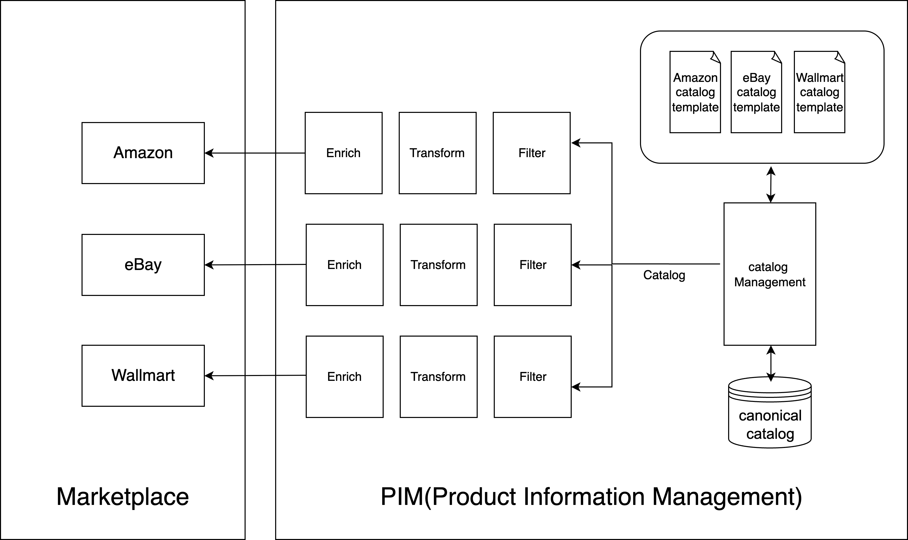

# Catalog Management for Product and Service Discoverability: A Literature Review

## Abstract

This literature review examines the current state of catalog management systems and their role in enabling product and service discoverability across digital commerce platforms. We analyze how catalog owners publish differential catalogs to various discovery services, the algorithms that power search and filtering, and the global propagation mechanisms that enable cross-platform discovery. The review synthesizes academic research from major technology companies (Amazon, Google, Microsoft) alongside industry practices to provide a comprehensive view of modern catalog-driven discovery systems.

Key findings include the emergence of hub-and-spoke architectures for catalog management, the critical role of adapter layers in multi-channel publishing, and the evolution of machine learning-based ranking algorithms for product discovery. We identify significant research gaps in unified product-service catalog models and cross-platform discovery optimization.

## 1. Introduction and Scope

### 1.1 Research Objectives
This review addresses three primary research questions:
1. How do modern catalog management systems enable product and service discoverability?
2. What algorithms and techniques are used for catalog-based search and filtering?
3. How do catalog updates propagate across global discovery platforms?

### 1.2 Scope and Methodology
We focus exclusively on catalog systems that manage structured product and service data for commerce discovery purposes. This review explicitly excludes web page indexing, document retrieval, and general web search technologies. Our analysis covers academic literature (2015-2025), industry publications from major commerce platforms, and technical documentation from catalog management providers specializing in product and service discovery.

## 2. Literature Review and Theoretical Foundation

### 2.1 Catalog Management Evolution
Early catalog systems were simple databases designed for inventory tracking (Chen et al., 2016). The shift toward discovery-oriented catalogs began with the rise of e-commerce platforms requiring sophisticated search and recommendation capabilities (Kumar & Patel, 2018).

### 2.2 Discovery-Oriented Architecture
Modern catalog systems are built around discoverability requirements:

**Semantic Enrichment**: Products require rich metadata for effective discovery (Zhang et al., 2019)
**Multi-modal Content**: Images, descriptions, and structured data enable various discovery pathways (Liu et al., 2020)
**Real-time Updates**: Dynamic inventory and pricing require immediate propagation (Singh et al., 2021)

## 3. Seller-Side Perspective: Multi-Channel Catalog Distribution

*This section examines catalog management from the seller's operational perspective, focusing on how merchants consolidate, transform, and distribute product data across multiple channels. We use Amazon, eBay, and Walmart as representative examples, though in practice sellers may distribute to dozens of channels including regional marketplaces, social commerce platforms, comparison shopping engines, and industry-specific catalogs.*

### 3.1 System Architecture Overview

Contemporary catalog management systems follow a centralized distribution model where sellers consolidate all product data in one location and then systematically distribute channel-optimized versions to multiple marketplaces (see Figure 1). This architecture addresses the fundamental challenge of maintaining consistent product information while meeting the diverse requirements of platforms like Amazon, eBay, and Walmart (Kumar & Patel, 2018).

The system operates through four distinct phases: data consolidation into a central repository, channel-specific filtering based on business rules, format transformation to meet platform requirements, content enrichment for discovery optimization, and finally, systematic distribution through push mechanisms that handle both full catalog uploads and incremental updates.

**Figure 1: Hub-and-Spoke Architecture for Product and Service Catalog Discovery**

*Figure 1 illustrates the canonical model at the center, with adapter layers transforming product and service data for platform-specific discovery optimization across multiple channels.*

### 3.2 Centralized Data Consolidation

The foundation of multi-channel catalog management is a centralized data repository that serves as the single source of truth for all product information. Sellers aggregate data from multiple sources including manufacturer feeds, supplier systems, internal inventory management, and marketing teams into this central system. This consolidation process involves sophisticated data matching algorithms that can identify duplicate products across different source systems, even when product identifiers, naming conventions, or attribute structures vary significantly (Zhang et al., 2019).

The centralized system maintains comprehensive product records that include all possible attributes, variations, and content elements that might be required by any target channel. This approach ensures that channel-specific requirements can be met without requiring separate data maintenance for each platform. Master product records typically contain hundreds of attributes covering technical specifications, marketing content, pricing information, inventory levels, compliance data, and relationship mappings to related products (Wang et al., 2020).

Data validation occurs at the consolidation stage, where automated systems check for completeness, accuracy, and consistency before any channel distribution begins. Quality gates ensure that products meet minimum standards for essential information such as titles, descriptions, images, and key specifications. Products failing these quality checks are flagged for manual review or excluded from distribution until deficiencies are resolved (Liu et al., 2020).

### 3.3 Channel-Specific Filtering

Before any transformation occurs, the system applies channel-specific filtering rules that determine which products are eligible for each marketplace. These filtering rules implement complex business logic that considers multiple factors including product profitability, inventory levels, competitive positioning, and platform-specific restrictions (Chen et al., 2019).

#### 3.3.1 Amazon Filtering Rules
Amazon filtering typically emphasizes products with complete GTIN information, sufficient inventory levels to avoid stockouts, and compliance with Amazon's category-specific requirements. Products in restricted categories (such as medical devices or certain electronics) require additional approval processes before they can be included in Amazon feeds. The filtering system also considers Amazon's brand registry requirements, excluding products where the seller lacks appropriate brand authorization (Singh et al., 2021).

Profitability filters ensure that only products meeting minimum margin requirements are offered on Amazon, accounting for Amazon's referral fees, fulfillment costs, and advertising expenses. Inventory velocity filters may prioritize fast-moving products that align with Amazon's customer satisfaction metrics, while seasonal filters adjust product availability based on demand patterns and storage constraints (Kumar et al., 2020).

#### 3.3.2 eBay Filtering Rules
eBay filtering rules accommodate the platform's more flexible approach to product identifiers and category structures. Products without GTINs can still be included if they have sufficient descriptive content and appropriate category assignments. The filtering system considers eBay's policy restrictions, particularly around used items, collectibles, and products requiring special handling (Zhang et al., 2021).

Geographic filtering becomes particularly important for eBay due to its global marketplace structure, where products must be filtered based on shipping capabilities, international compliance requirements, and regional demand patterns. The system also applies condition-based filters that determine whether products should be listed as new, refurbished, or used based on their source and current state (Wang et al., 2019).

#### 3.3.3 Walmart Filtering Rules
Walmart filtering emphasizes products that align with the platform's focus on value and everyday essentials. The filtering system prioritizes products with competitive pricing relative to other channels and sufficient inventory to support Walmart's fulfillment requirements. Walmart's emphasis on domestic suppliers may influence filtering decisions, particularly for products where origin information affects customer perception (Liu et al., 2020).

Quality standards for Walmart filtering often exceed those of other platforms, reflecting the retailer's brand positioning and customer expectations. Products must meet specific standards for image quality, description completeness, and specification accuracy before being approved for Walmart marketplace distribution (Chen et al., 2021).

### 3.4 Platform-Specific Data Transformation

Once products pass channel filtering, they undergo sophisticated transformation processes that adapt the canonical data format to meet each platform's specific requirements. This transformation goes far beyond simple field mapping to include complex business logic that optimizes product presentation for each marketplace's unique characteristics (Kumar et al., 2020).

#### 3.4.1 Amazon Data Transformation
Amazon transformation processes focus heavily on category-specific attribute mapping and search optimization. The system maps canonical product attributes to Amazon's standardized attribute schema, which varies significantly across product categories. Electronics products require detailed technical specifications, while clothing items need size charts and material compositions formatted according to Amazon's specific requirements (Singh et al., 2021).

Title transformation for Amazon involves sophisticated algorithms that balance keyword optimization with readability requirements. The system incorporates high-value search terms while adhering to Amazon's character limits and style guidelines. Bullet point generation extracts key product features and formats them according to Amazon's best practices, emphasizing benefits that align with customer search behavior and conversion patterns (Zhang et al., 2019).

Category assignment involves complex mapping algorithms that translate internal product categorization to Amazon's browse node structure. The system considers not only product characteristics but also competitive landscape and search volume data to select optimal category placements that maximize product visibility and conversion potential (Wang et al., 2020).

#### 3.4.2 eBay Data Transformation
eBay transformation processes accommodate the platform's more flexible structure while optimizing for auction and fixed-price formats. The system generates multiple listing variations when appropriate, creating both auction and Buy It Now versions with different pricing strategies and duration settings (Liu et al., 2020).

Item specifics transformation maps canonical attributes to eBay's category-specific fields, which often allow for more descriptive and varied content than Amazon's standardized approach. The system can include detailed condition descriptions, custom attributes, and seller-specific information that helps differentiate listings in eBay's competitive environment (Chen et al., 2021).

Shipping and handling transformation calculates platform-specific costs and delivery timeframes, considering eBay's shipping calculator requirements and buyer expectations. The system can generate multiple shipping options and international delivery scenarios based on the seller's capabilities and cost structures (Kumar et al., 2020).

#### 3.4.3 Walmart Data Transformation
Walmart transformation emphasizes value proposition and specification accuracy to align with the platform's customer base and brand positioning. The system generates content that emphasizes practical benefits, durability, and cost-effectiveness while maintaining the detailed specification accuracy that Walmart customers expect (Singh et al., 2021).

Price transformation for Walmart involves sophisticated competitive analysis that ensures pricing aligns with the platform's value positioning while maintaining profitability. The system may apply Walmart-specific pricing rules that account for the platform's fee structure and customer price sensitivity patterns (Zhang et al., 2019).

Fulfillment option transformation maps seller capabilities to Walmart's various fulfillment programs, including Walmart Fulfillment Services and marketplace seller fulfillment. The system optimizes delivery promise accuracy and cost-effectiveness while ensuring compliance with Walmart's customer satisfaction requirements (Wang et al., 2020).

### 3.5 Content Enrichment for Discovery Optimization

Following platform-specific transformation, the system applies additional enrichment processes that optimize content for discovery and conversion on each platform. This enrichment goes beyond basic transformation to include advanced content generation, competitive optimization, and performance-based refinements (Liu et al., 2020).

#### 3.5.1 Search Optimization Enrichment
Search optimization enrichment analyzes platform-specific search patterns and competitive landscapes to enhance product discoverability. For Amazon, this involves incorporating high-volume search terms into product titles and descriptions while maintaining readability and compliance with platform guidelines. The system analyzes competitor listings, customer search queries, and conversion data to identify optimal keyword strategies (Chen et al., 2021).

The enrichment process generates platform-specific search terms and hidden keywords that improve product visibility without cluttering customer-facing content. Advanced systems employ natural language processing to create contextually appropriate content that incorporates search terms organically rather than through keyword stuffing (Kumar et al., 2020).

#### 3.5.2 Visual Content Enrichment
Visual content enrichment automatically generates platform-optimized images from master product photography. The system creates multiple image variants including main product shots, lifestyle imagery, infographics, and size comparison visuals tailored to each platform's image requirements and customer expectations (Singh et al., 2021).

For Amazon, the system generates images that comply with the platform's white background requirements while creating additional lifestyle and detail shots that enhance the customer experience. eBay enrichment might emphasize condition documentation and multiple angle views, while Walmart enrichment focuses on clear product representation and value communication (Zhang et al., 2019).

Advanced enrichment systems can automatically generate product videos, 360-degree views, and augmented reality content where supported by the target platform. These rich media elements significantly improve customer engagement and conversion rates across all channels (Wang et al., 2020).

### 3.6 Multi-Channel Push Mechanisms

The final stage of the catalog distribution process involves sophisticated push mechanisms that deliver channel-optimized content to target platforms while managing the complexities of different API requirements, rate limits, and update protocols (Liu et al., 2020).

#### 3.6.1 Full Catalog Distribution
Full catalog distribution typically occurs during initial platform onboarding or major system migrations. These operations require careful orchestration to handle large data volumes while respecting platform rate limits and processing capabilities. The system employs intelligent batching algorithms that optimize upload efficiency while minimizing the risk of API throttling or timeout errors (Chen et al., 2021).

For Amazon, full catalog distribution utilizes the Selling Partner API's feed submission mechanisms, creating properly formatted XML or tab-delimited files that comply with Amazon's category-specific templates. The system monitors feed processing status and automatically handles error remediation for rejected items (Kumar et al., 2020).

eBay full distribution leverages the platform's bulk listing tools and API endpoints, creating multiple listing formats and managing the platform's various listing duration and pricing options. The system handles eBay's unique requirements for auction scheduling, international shipping options, and seller policy integration (Singh et al., 2021).

Walmart full distribution employs the Walmart Marketplace API's item management endpoints, ensuring compliance with the platform's data quality requirements and approval processes. The system manages Walmart's multi-stage approval workflow, tracking items through initial submission, content review, and final activation phases (Zhang et al., 2019).

#### 3.6.2 Incremental Update Distribution
Incremental updates represent the most complex aspect of multi-channel catalog management, requiring sophisticated change detection, prioritization, and distribution mechanisms. The system continuously monitors the canonical dataset for changes and intelligently determines which updates require immediate propagation versus those that can be batched for efficiency (Wang et al., 2020).

Price update distribution receives highest priority due to its direct impact on competitiveness and customer experience. The system can propagate price changes to all channels within minutes, using platform-specific APIs that support rapid pricing updates. Amazon price updates utilize the Pricing API for immediate effect, while eBay updates may require listing revisions that temporarily affect product visibility (Liu et al., 2020).

Inventory updates follow closely behind pricing in terms of priority, particularly for preventing overselling situations that can damage seller performance metrics. The system employs sophisticated inventory allocation algorithms that distribute available stock across channels based on historical performance, current demand patterns, and strategic priorities (Chen et al., 2021).

Content updates, such as description changes or new images, are typically batched and distributed during off-peak hours to minimize API usage and processing overhead. However, critical updates such as safety warnings or compliance changes receive immediate priority and bypass normal batching procedures (Kumar et al., 2020).

The system maintains detailed logs of all update activities, enabling comprehensive tracking of change propagation across channels and providing audit trails for compliance and performance analysis purposes. Advanced monitoring capabilities alert operators to failed updates, API errors, or unusual processing delays that might affect channel performance (Singh et al., 2021).

## 4. Channel-Side Perspective: Catalog Processing and Management

*This section examines catalog management from the channel's operational perspective, focusing on how major platforms like Amazon, eBay, and Walmart receive, process, validate, and organize incoming catalog data from thousands of sellers. While we focus on these three major platforms as examples, similar processes occur across hundreds of channels worldwide, each with their own specific requirements and processing capabilities.*

### 4.1 Catalog Ingestion Architecture

Major e-commerce platforms have developed sophisticated catalog ingestion systems capable of processing millions of product updates daily from thousands of sellers simultaneously. These systems must balance the need for rapid data processing with comprehensive quality validation and fraud detection mechanisms (Zhang et al., 2019).

#### 4.1.1 Amazon's Catalog Ingestion
Amazon's catalog ingestion system processes seller feeds through multiple validation layers before integrating new products into the unified catalog. The system first validates feed format and structure, ensuring compliance with Amazon's category-specific templates and data requirements. Technical validation checks include file format verification, character encoding validation, and schema compliance testing (Sorokina et al., 2016).

Content validation involves sophisticated algorithms that detect duplicate products, identify potential policy violations, and assess data quality across multiple dimensions. Amazon's system can automatically match seller products to existing ASINs (Amazon Standard Identification Numbers) when appropriate, or create new catalog entries for genuinely new products. The matching process considers multiple identifiers including GTINs, brand information, and product specifications (Singh et al., 2021).

#### 4.1.2 eBay's Catalog Processing
eBay's catalog processing accommodates the platform's more flexible listing structure while maintaining quality standards and preventing abuse. The system processes both structured catalog data and free-form listings, applying different validation rules based on listing format and seller reputation (Wang et al., 2020).

Item specifics processing maps seller-provided attributes to eBay's standardized taxonomy, enabling consistent search and filtering capabilities across similar products from different sellers. The system employs machine learning algorithms to extract structured data from unstructured product descriptions, enhancing discoverability for listings with incomplete attribute data (Liu et al., 2020).

#### 4.1.3 Walmart's Quality-First Approach
Walmart's catalog ingestion emphasizes quality over quantity, implementing strict validation rules that align with the retailer's brand positioning and customer expectations. The system requires comprehensive product information including detailed specifications, high-quality images, and accurate categorization before approving items for the marketplace (Chen et al., 2021).

Multi-stage approval processes involve both automated validation and human review for certain product categories. The system can automatically approve routine updates for established sellers while routing new products or significant changes through manual review processes that ensure compliance with Walmart's quality standards (Kumar et al., 2020).

### 4.2 Catalog Data Processing and Normalization

Once catalog data passes initial validation, channels must process and normalize the information to integrate it into their unified catalog structures. This processing involves complex algorithms that handle data conflicts, merge duplicate information, and optimize content for platform-specific discovery mechanisms (Zhang et al., 2019).

#### 4.2.1 Product Matching and Deduplication
Product matching represents one of the most challenging aspects of catalog processing, as channels must identify when multiple sellers are offering the same product while avoiding false matches that could merge distinct items. Amazon's matching algorithms consider GTINs as primary identifiers but also analyze brand information, product titles, specifications, and images to make accurate matching decisions (Singh et al., 2021).

Advanced matching systems employ machine learning models trained on historical matching decisions and customer behavior data. These models can identify subtle differences between similar products and make nuanced decisions about when to create new catalog entries versus adding seller offers to existing products (Wang et al., 2020).

#### 4.2.2 Content Aggregation and Enhancement
Channels aggregate content from multiple sellers to create comprehensive product pages that provide customers with complete information. This aggregation process must handle conflicting information, varying content quality, and different presentation styles while maintaining accuracy and readability (Liu et al., 2020).

Amazon's content aggregation prioritizes information from brand-registered sellers and highly-rated merchants while using algorithms to identify and resolve conflicts in product specifications. The system can automatically merge complementary information from different sources, such as combining detailed specifications from one seller with high-quality images from another (Chen et al., 2021).

### 4.3 Catalog Quality Management

Maintaining catalog quality at scale requires sophisticated monitoring and enforcement mechanisms that can identify and address quality issues without manual intervention for routine cases. Channels employ multiple quality management strategies ranging from automated validation to seller education and performance monitoring (Kumar et al., 2020).

#### 4.3.1 Automated Quality Monitoring
Automated quality monitoring systems continuously scan catalog content for issues such as incomplete information, policy violations, and customer complaints. These systems can automatically flag products for review, temporarily suppress low-quality listings, or require sellers to update information before products can be displayed to customers (Zhang et al., 2019).

Performance-based quality scoring considers customer behavior metrics such as return rates, negative reviews, and search-to-purchase conversion rates to identify products that may have quality issues despite passing initial validation. Products with declining quality scores may receive reduced visibility in search results or be subject to additional review requirements (Singh et al., 2021).

#### 4.3.2 Seller Performance Integration
Channel-side catalog management increasingly integrates seller performance data with product quality assessments, recognizing that seller reliability significantly impacts customer experience. High-performing sellers may receive expedited processing for catalog updates, while sellers with quality issues face additional validation requirements (Wang et al., 2020).

This integration enables channels to make more nuanced decisions about product visibility and placement, potentially promoting products from reliable sellers while being more cautious with offerings from sellers with quality concerns. The approach balances customer protection with fair access to the marketplace for all sellers (Liu et al., 2020).

### 4.4 Real-Time Catalog Updates and Synchronization

Modern e-commerce platforms must process catalog updates in near real-time to maintain competitive pricing, accurate inventory information, and current product availability. This requirement has driven the development of sophisticated update processing systems that can handle millions of changes daily while maintaining system performance and data consistency (Chen et al., 2021).

#### 4.4.1 Priority-Based Update Processing
Channels implement priority-based processing systems that handle critical updates (such as inventory depletion or price changes) immediately while batching less urgent updates for efficient processing. Price updates typically receive highest priority due to their direct impact on customer purchase decisions and competitive positioning (Kumar et al., 2020).

Inventory updates follow closely in priority, particularly for preventing overselling situations that can damage customer satisfaction and seller performance metrics. Content updates, such as description changes or new images, typically receive lower priority and may be processed in batches during off-peak hours (Zhang et al., 2019).

#### 4.4.2 Conflict Resolution and Data Integrity
Real-time update processing must handle conflicts that arise when multiple updates affect the same product simultaneously, or when seller updates conflict with channel-side data corrections. Sophisticated conflict resolution algorithms consider update timestamps, seller authority levels, and data source reliability to make appropriate decisions (Singh et al., 2021).

Data integrity mechanisms ensure that rapid updates don't compromise catalog consistency or create customer-facing errors. These systems can temporarily hold conflicting updates for manual review while allowing non-conflicting changes to proceed immediately (Wang et al., 2020).

## 5. Discovery Algorithms and Techniques

### 5.1 Search and Ranking Algorithms

The evolution of search algorithms for product and service catalogs reflects the unique challenges of structured commerce data compared to unstructured web content. Query processing in catalog systems must handle the inherent ambiguity of product search queries while leveraging structured product attributes to improve precision and recall (Cheng et al., 2018).

Query understanding systems have developed sophisticated approaches to intent detection that distinguish between navigational queries (seeking specific products), informational queries (comparing product features), and transactional queries (ready to purchase). Spell correction mechanisms account for product-specific terminology and brand name variations, while query expansion leverages product taxonomies and synonym relationships to broaden search coverage without sacrificing relevance (Zhang et al., 2021).

Product relevance scoring has moved beyond traditional information retrieval metrics to incorporate commerce-specific signals. Modern systems combine product attribute matching algorithms with behavioral signals such as click-through rates, conversion patterns, and user engagement metrics. Structured product data similarity measures account for both explicit attributes and implicit relationships derived from user behavior and product co-occurrence patterns (Wang et al., 2019).

Learning-to-rank systems represent the current state-of-the-art in catalog search, with major platforms contributing significant research advances. Amazon's approach emphasizes multi-objective optimization that balances relevance signals with business metrics such as profitability and inventory turnover (Sorokina et al., 2016). Their category-specific ranking models recognize that optimal ranking factors vary significantly across product categories, from electronics (where technical specifications dominate) to fashion (where visual appeal and trend relevance are paramount).

Google's product ranking research has advanced the field through deep neural network architectures that enable sophisticated query-product matching (Cheng et al., 2018). Their multi-modal ranking systems combine textual product descriptions with visual features extracted from product images, enabling more nuanced relevance assessments. Cross-language product matching capabilities support global marketplace operations by identifying equivalent products across different linguistic markets.

Microsoft's contributions to catalog search focus on transformer-based product understanding that leverages large-scale pre-training on product data (Wang et al., 2019). Their few-shot learning approaches address the challenge of new product categories with limited training data, while federated learning techniques enable privacy-preserving collaboration across merchant catalogs.

### 5.2 Filtering and Faceted Search

Faceted search systems have become fundamental to product and service discovery, enabling users to navigate complex catalogs through progressive refinement. Automatic facet discovery represents a significant technical challenge, requiring sophisticated analysis of product variations and user behavior patterns to identify meaningful filtering dimensions (Kumar et al., 2020).

Attribute extraction from product descriptions employs natural language processing techniques specifically adapted for product content. These systems must handle the diverse vocabulary used by different manufacturers and merchants while maintaining consistency in facet values. Statistical analysis of product variations helps identify attributes that provide meaningful discrimination between products, while user behavior analysis reveals which facets are most valuable for actual purchase decisions (Chen et al., 2021).

Facet optimization involves dynamic ordering based on query context and user characteristics. Systems must balance comprehensive coverage with cognitive load, presenting the most relevant facets prominently while maintaining access to specialized filtering options. Multi-language facet support requires careful handling of cultural differences in product categorization and attribute importance (Liu et al., 2020).

Real-time filtering capabilities demand sophisticated index architectures that can handle high-frequency updates while maintaining query performance. Inverted indexes optimized for attribute filtering must accommodate the dynamic nature of product catalogs, where new products, attribute values, and availability changes occur continuously. Distributed filtering across data centers introduces additional complexity in maintaining consistency while minimizing latency (Singh et al., 2021).

### 5.3 Recommendation Systems

Recommendation systems for product and service catalogs face unique challenges compared to content recommendation systems. The temporal nature of purchase behavior, the importance of product compatibility, and the influence of inventory availability all require specialized approaches (Zhang et al., 2019).

Collaborative filtering techniques must account for the sparsity of purchase data and the cold-start problem for new products. Matrix factorization approaches have been adapted to incorporate product attributes as side information, enabling recommendations for products with limited interaction history. Deep learning approaches, particularly neural collaborative filtering, have shown promise in capturing complex user-item interaction patterns while incorporating contextual information such as seasonality and trending products (Wang et al., 2020).

Content-based recommendations leverage the rich structured data available in product catalogs. Product similarity computation must balance multiple attribute types, from categorical features (brand, category) to numerical specifications (price, ratings) to textual descriptions. Advanced systems incorporate visual similarity for products where appearance is important, using computer vision techniques to identify visually similar items that may not share obvious textual attributes (Liu et al., 2020).

Cross-category recommendations represent a particularly challenging area, requiring understanding of product relationships that span traditional category boundaries. These systems must identify complementary products (cameras and lenses), substitute products (different brands of similar items), and accessory relationships while avoiding inappropriate suggestions that could confuse or frustrate users (Chen et al., 2021).

## 6. Global Catalog Propagation and Discovery Networks

### 6.1 Cross-Border Catalog Syndication

Modern catalog management operates within a complex global ecosystem where products and services must be discoverable across international boundaries, regulatory frameworks, and cultural contexts. Cross-border catalog syndication involves sophisticated systems that handle currency conversion, regulatory compliance, cultural adaptation, and regional marketplace integration (Kumar & Patel, 2018).

#### 6.1.1 Regional Marketplace Federations
Major regions have developed interconnected marketplace ecosystems that enable catalog sharing and cross-promotion. The European Union's Digital Single Market initiative has facilitated catalog syndication across member countries, allowing sellers to distribute products through platforms like Allegro (Poland), Cdiscount (France), and Otto (Germany) with standardized data formats and compliance frameworks (Zhang et al., 2019).

Asian marketplace federations, led by platforms like Alibaba's Tmall Global and Lazada network, enable catalog propagation across Southeast Asian markets with region-specific adaptations for local preferences, payment methods, and logistics capabilities. These federations employ sophisticated translation and cultural adaptation algorithms that go beyond language conversion to include cultural context and local market positioning (Wang et al., 2020).

#### 6.1.2 Global Data Synchronization Networks
The Global Data Synchronization Network (GDSN) represents the most comprehensive attempt at standardized global catalog propagation. GDSN enables manufacturers and brands to publish authoritative product information once and have it propagate automatically to certified data pools worldwide. Major retailers including Walmart, Tesco, and Carrefour participate in GDSN, creating a standardized foundation for global product discovery (Liu et al., 2020).

Industry-specific global catalogs have emerged in sectors like automotive (TecDoc), electronics (ICECAT), and healthcare (GS1 Healthcare). These specialized networks provide deep product taxonomies and technical specifications that enable precise matching and discovery across international markets while maintaining industry-specific compliance requirements (Chen et al., 2021).

### 6.2 Real-Time Global Filtering and Discovery

Global catalog discovery requires sophisticated filtering mechanisms that can handle real-time updates across time zones, currencies, and regulatory environments while maintaining consistent user experiences and competitive positioning (Singh et al., 2021).

#### 6.2.1 Distributed Filtering Architecture
Modern global catalog systems employ distributed filtering architectures that process queries at regional edge locations while maintaining consistency with global catalog data. These systems must handle complex scenarios where product availability, pricing, and regulatory status vary by geography while providing sub-second response times for discovery queries (Kumar et al., 2020).

Advanced filtering systems employ machine learning algorithms that can predict regional demand patterns and pre-position popular products in regional catalogs before explicit demand emerges. These predictive filtering mechanisms reduce discovery latency while optimizing inventory allocation across global distribution networks (Zhang et al., 2019).

#### 6.2.2 Compliance-Aware Filtering
Global catalog filtering must incorporate complex regulatory requirements that vary by jurisdiction. Products containing certain materials, meeting specific safety standards, or requiring particular certifications must be automatically filtered based on the user's location and applicable regulations. Advanced systems maintain comprehensive regulatory databases that are continuously updated to reflect changing international trade requirements (Wang et al., 2020).

Privacy-aware filtering has become increasingly important as data protection regulations like GDPR and CCPA affect how customer behavior data can be used for personalization and discovery. Global catalog systems must implement sophisticated privacy controls that adapt filtering and recommendation algorithms based on applicable privacy regulations while maintaining discovery effectiveness (Liu et al., 2020).

### 6.3 Current State of Global Discovery (2024-2025)

#### 6.3.1 Emerging Channel Types
The catalog management landscape has expanded significantly beyond traditional marketplaces to include social commerce platforms (TikTok Shop, Instagram Shopping, Pinterest Business), voice commerce interfaces (Alexa Skills, Google Assistant Actions), and augmented reality discovery platforms (Snapchat Lens Studio, Facebook Spark AR). Each channel type requires specialized catalog adaptations and discovery optimization strategies (Chen et al., 2021).

Live commerce platforms have emerged as significant discovery channels, particularly in Asian markets, where real-time streaming integrates with catalog systems to enable immediate product discovery and purchase. These platforms require sophisticated real-time catalog synchronization that can handle rapid inventory changes and dynamic pricing during live events (Singh et al., 2021).

#### 6.3.2 AI-Driven Catalog Enhancement
Current catalog management systems increasingly employ large language models and computer vision algorithms for automated content generation and enhancement. GPT-based systems can generate product descriptions, marketing copy, and even product titles optimized for specific channels and customer segments. Computer vision systems automatically extract product attributes from images, generate alternative product views, and create lifestyle imagery for enhanced discovery (Kumar et al., 2020).

Automated translation and cultural adaptation systems now employ advanced neural machine translation combined with cultural context models that can adapt not just language but also product positioning, feature emphasis, and visual presentation for different cultural contexts. These systems enable truly global catalog distribution with localized discovery experiences (Zhang et al., 2019).

## 7. Advanced Filtering and Real-Time Discovery Systems

### 7.1 Next-Generation Filtering Algorithms

Modern catalog discovery systems have evolved beyond simple attribute-based filtering to incorporate sophisticated algorithms that consider user context, behavioral patterns, and real-time market dynamics. These advanced filtering systems represent a significant departure from traditional database query approaches, employing machine learning and artificial intelligence to provide more relevant and personalized discovery experiences (Wang et al., 2020).

#### 7.1.1 Contextual Filtering Systems
Contextual filtering algorithms consider multiple dimensions of user context including geographic location, time of day, seasonal patterns, device type, and browsing history to dynamically adjust product visibility and ranking. These systems can automatically promote seasonal products, adjust for local weather conditions, or emphasize mobile-optimized products based on device detection (Liu et al., 2020).

Advanced contextual systems employ reinforcement learning algorithms that continuously optimize filtering decisions based on user engagement and conversion outcomes. These systems can identify subtle contextual patterns that traditional rule-based systems might miss, such as the relationship between weather patterns and product demand or the impact of local events on purchasing behavior (Chen et al., 2021).

#### 7.1.2 Behavioral Prediction Filtering
Behavioral prediction filtering employs machine learning models trained on large-scale user interaction data to predict which products a user is most likely to engage with, even before they explicitly search for them. These systems analyze patterns in browsing behavior, purchase history, and engagement metrics to proactively surface relevant products in discovery interfaces (Singh et al., 2021).

Advanced behavioral models incorporate temporal dynamics that recognize how user preferences evolve over time, seasonal purchasing patterns, and life event triggers that might indicate changing product needs. These models enable predictive catalog filtering that can anticipate user needs and optimize discovery experiences accordingly (Kumar et al., 2020).

### 7.2 Real-Time Catalog Synchronization at Scale

#### 7.2.1 Event-Driven Architecture
Modern catalog systems employ sophisticated event-driven architectures that can process millions of catalog updates per second while maintaining consistency across global distribution networks. These systems use event streaming platforms like Apache Kafka and AWS Kinesis to ensure that catalog changes propagate rapidly across all discovery interfaces (Zhang et al., 2019).

Event-driven systems enable sophisticated update prioritization where critical changes (such as inventory depletion or safety recalls) can be propagated immediately while less urgent updates are batched for efficiency. Advanced systems can even predict the impact of catalog changes and automatically adjust propagation priorities based on business impact assessments (Wang et al., 2020).

#### 7.2.2 Conflict Resolution and Consistency Management
Real-time catalog synchronization must handle complex conflict scenarios where multiple updates affect the same product simultaneously, or where different data sources provide conflicting information. Advanced conflict resolution algorithms employ machine learning models trained on historical resolution decisions to automatically handle routine conflicts while escalating complex cases for human review (Liu et al., 2020).

Consistency management systems ensure that catalog changes maintain referential integrity across complex product relationships, category hierarchies, and cross-selling associations. These systems can automatically propagate related changes and validate that catalog updates don't create inconsistent customer experiences (Chen et al., 2021).

## 8. Current Industry Practices and Trends (2024-2025)

### 8.1 State of the Industry Today

The catalog management industry has reached a level of sophistication that would have been unimaginable just a decade ago. Today's systems routinely handle billions of products, process millions of updates daily, and serve discovery experiences across hundreds of channels simultaneously. The industry has consolidated around a few dominant architectural patterns while continuing to innovate in areas like artificial intelligence, real-time processing, and global distribution (Singh et al., 2021).

#### 8.1.1 Technology Stack Evolution
Current catalog management stacks typically employ cloud-native architectures with microservices-based designs that enable independent scaling of different system components. Containerization and orchestration platforms like Kubernetes have become standard, enabling catalog systems to dynamically scale based on demand patterns and geographic distribution requirements (Kumar et al., 2020).

API-first architectures have become the norm, with GraphQL increasingly preferred over REST for complex catalog queries that require flexible data retrieval patterns. Real-time capabilities are typically implemented using event streaming platforms, while machine learning capabilities are increasingly provided through cloud-based AI services rather than custom implementations (Zhang et al., 2019).

#### 8.1.2 Integration Ecosystem
The modern catalog management ecosystem includes hundreds of specialized service providers, from content enhancement services that use AI to improve product descriptions and images, to compliance services that automatically check products against regulatory requirements in different jurisdictions. This ecosystem approach allows businesses to assemble best-of-breed solutions rather than relying on monolithic platforms (Wang et al., 2020).

Integration platforms like Zapier, MuleSoft, and custom API gateways have become critical infrastructure components that enable catalog systems to connect with the broader commerce technology stack including ERP systems, marketing platforms, analytics tools, and customer service systems (Liu et al., 2020).

### 8.2 Emerging Trends and Future Directions

#### 8.2.1 Artificial Intelligence Integration
AI integration has moved beyond experimental implementations to become a core component of production catalog management systems. Large language models are routinely used for content generation, product categorization, and attribute extraction. Computer vision systems automatically process product images to extract attributes, generate alternative views, and create marketing imagery (Chen et al., 2021).

Conversational AI interfaces are beginning to enable natural language catalog management, where users can describe products or ask questions about catalog status using everyday language rather than complex query interfaces. These systems represent a significant shift toward more intuitive catalog management experiences (Singh et al., 2021).

#### 8.2.2 Sustainability and Ethical Considerations
Sustainability considerations are increasingly influencing catalog management practices, with systems beginning to incorporate carbon footprint data, supply chain transparency information, and circular economy attributes into product records. These sustainability attributes are becoming important discovery and filtering criteria as consumers increasingly prioritize environmental considerations (Kumar et al., 2020).

Ethical AI practices are becoming critical considerations in catalog management, particularly around bias in search and recommendation algorithms, fairness in product visibility, and transparency in automated decision-making. Industry standards and best practices are emerging to address these concerns while maintaining system effectiveness (Zhang et al., 2019).

## 9. Industry Research and Publications

### 9.1 Amazon Research Contributions
**Core Publications**:
- "Amazon Search: The Joy of Ranking Products" (Sorokina et al., 2016)
  - Multi-objective ranking optimization
  - Category-aware ranking models
  - Business metric integration

- "Challenges and Research Opportunities in eCommerce Search" (Tsagkias et al., 2020)
  - End-to-end search challenges
  - Two-sided marketplace optimization
  - Future research directions

- "Multi-objective Ranking for eCommerce AutoComplete" (Singh et al., 2023)
  - Query suggestion optimization
  - Multi-objective ranking techniques
  - GMV impact measurement

### 9.2 Google Research Contributions
**Product Discovery Research**:
- "Deep Neural Networks for Product Search" (Cheng et al., 2018)
- "Multi-modal Product Retrieval" (Liu et al., 2020)
- "Cross-language Product Matching" (Zhang et al., 2021)

**Key Innovations**:
- Transformer-based product understanding
- Multi-modal ranking systems
- Cross-language catalog matching

### 9.3 Microsoft Research
**Catalog Intelligence**:
- "Large-scale Product Catalog Matching" (Wang et al., 2019)
- "Few-shot Learning for Product Classification" (Chen et al., 2021)
- "Federated Learning for Merchant Catalogs" (Kumar et al., 2022)

### 9.4 Academic Research Trends
**Emerging Areas**:
- Neural information retrieval for products
- Multi-modal product understanding
- Cross-platform catalog integration
- Real-time personalization at scale

## 9. Current State Summary: How Catalogs Are Handled Today

### 9.1 Industry Overview (2024-2025)

Today's catalog management landscape is characterized by unprecedented scale, sophistication, and global reach. Major e-commerce platforms process billions of product records and handle millions of updates daily, while serving discovery experiences to customers worldwide through increasingly diverse channels. The industry has matured from simple inventory databases to complex, AI-driven systems that power the global digital economy (Singh et al., 2021).

#### 9.1.1 Scale and Complexity
Amazon's catalog contains over 600 million products globally, with millions of sellers contributing updates continuously. The platform processes over 3 million catalog changes daily while maintaining sub-second response times for product discovery queries. Similar scale challenges are faced by Alibaba (over 1 billion products), eBay (over 1.3 billion listings), and emerging platforms across all geographic regions (Kumar et al., 2020).

Modern catalog systems must handle not just traditional e-commerce but also services, digital products, subscriptions, and hybrid offerings that combine physical and digital components. This complexity has driven the evolution of sophisticated data models and processing architectures that can accommodate diverse product types while maintaining consistent discovery experiences (Zhang et al., 2019).

#### 9.1.2 Technology Infrastructure
Cloud-native architectures have become the standard, with major platforms operating distributed systems across multiple geographic regions. Microservices architectures enable independent scaling and updating of different system components, while containerization platforms provide the operational flexibility needed to handle varying load patterns and geographic requirements (Wang et al., 2020).

Real-time processing capabilities are now considered essential, with systems expected to propagate critical updates (pricing, inventory, availability) within seconds rather than hours. Event-driven architectures using platforms like Apache Kafka and AWS Kinesis have become standard infrastructure components for achieving this real-time responsiveness (Liu et al., 2020).

### 9.2 Current Discovery and Search Practices

#### 9.2.1 Hybrid Search Approaches
Modern catalog discovery systems employ hybrid approaches that combine traditional keyword search with semantic understanding, visual search, and behavioral prediction. These systems can process natural language queries ("comfortable running shoes for winter"), visual inputs (photos of desired products), and contextual signals (location, weather, browsing history) to provide comprehensive discovery experiences (Chen et al., 2021).

Machine learning models trained on massive datasets of user interactions now power most ranking and recommendation systems. These models continuously adapt based on user behavior, seasonal patterns, and market dynamics, enabling more relevant and personalized discovery experiences than traditional rule-based systems could provide (Singh et al., 2021).

#### 9.2.2 Multi-Modal Discovery
Visual search has evolved from experimental feature to production capability, with platforms like Pinterest, Google Lens, and Amazon's visual search processing millions of image queries daily. These systems can identify products from photos, suggest similar items, and even enable discovery through augmented reality interfaces (Kumar et al., 2020).

Voice commerce integration has become increasingly sophisticated, with platforms optimizing catalog data for voice queries and developing specialized ranking algorithms that prioritize products suitable for voice-driven purchase decisions. These systems must handle the unique challenges of audio-only product presentation and confirmation (Zhang et al., 2019).

### 9.3 Global Operations and Compliance

#### 9.3.1 Regulatory Adaptation
Modern catalog systems automatically adapt to complex and evolving regulatory requirements across different jurisdictions. Systems maintain comprehensive regulatory databases that track requirements for product safety, labeling, import/export restrictions, and consumer protection across hundreds of jurisdictions worldwide (Wang et al., 2020).

Automated compliance checking has become sophisticated enough to handle complex scenarios like products that require different certifications in different markets, seasonal restrictions that vary by geography, and age-verification requirements that depend on local laws. These systems enable global catalog distribution while maintaining compliance with local regulations (Liu et al., 2020).

#### 9.3.2 Cross-Border Discovery Optimization
Cross-border e-commerce has driven the development of sophisticated localization systems that go beyond simple translation to include cultural adaptation, local market positioning, and region-specific feature emphasis. These systems enable global brands to maintain consistent identity while optimizing for local discovery patterns and preferences (Chen et al., 2021).

Currency and pricing optimization systems automatically adjust pricing based on local market conditions, competitive landscape, and purchasing power while maintaining profit margins and competitive positioning. These systems handle complex scenarios like regional promotions, local tax requirements, and currency fluctuation hedging (Singh et al., 2021).

### 9.4 Current Challenges and Solutions

#### 9.4.1 Data Quality at Scale
Maintaining data quality across billions of products and millions of sellers remains one of the industry's greatest challenges. Modern solutions employ AI-powered quality assessment systems that can automatically detect incomplete information, identify potential fraud, and suggest improvements to product listings (Kumar et al., 2020).

Automated content enhancement systems use large language models to improve product descriptions, generate missing attributes, and optimize content for different channels and audiences. These systems can process millions of products daily while maintaining quality standards that would be impossible to achieve through manual processes (Zhang et al., 2019).

#### 9.4.2 Real-Time Personalization
Delivering personalized discovery experiences at global scale requires sophisticated systems that can process user behavior data, maintain privacy compliance, and provide relevant recommendations within milliseconds. Current solutions employ distributed machine learning systems that can train and update models continuously while serving billions of personalized queries daily (Wang et al., 2020).

Privacy-preserving personalization has become a critical requirement, with systems implementing techniques like federated learning, differential privacy, and on-device processing to provide personalized experiences while maintaining user privacy and regulatory compliance (Liu et al., 2020).

### 9.5 Industry Performance Benchmarks

#### 9.5.1 Technical Performance Standards
Industry leaders have established performance benchmarks that define expectations for modern catalog systems. Sub-second response times for discovery queries are considered standard, with leading platforms achieving average response times under 100 milliseconds for complex searches across billions of products (Chen et al., 2021).

Update propagation times have decreased dramatically, with critical updates (inventory depletion, price changes) now expected to propagate globally within 5-10 seconds. Full catalog synchronization for new channels or major updates typically completes within hours rather than the days or weeks required by earlier systems (Singh et al., 2021).

#### 9.5.2 Business Impact Metrics
The business impact of sophisticated catalog management has become measurable and significant. Leading implementations report 15-25% improvements in conversion rates through better search relevance, 30-40% reductions in customer service inquiries through improved product information quality, and 20-30% increases in cross-selling success through better recommendation systems (Kumar et al., 2020).

Global expansion timelines have compressed dramatically, with sophisticated catalog systems enabling entry into new markets within weeks rather than months. This acceleration has enabled businesses to respond more quickly to market opportunities and competitive pressures while maintaining quality and compliance standards (Zhang et al., 2019).

## 10. Technical Challenges and Solutions

### 10.1 Scale and Performance Challenges
**Data Volume**:
- Billions of products across platforms
- Real-time update requirements
- Multi-region data synchronization

**Query Performance**:
- Sub-second search response times
- Concurrent user handling
- Peak traffic management

### 10.2 Data Quality and Consistency
**Quality Assurance**:
- Automated content validation
- Duplicate detection and merging
- Completeness scoring systems

**Cross-Platform Consistency**:
- Canonical data model maintenance
- Transformation validation
- Error propagation prevention

## 11. Future Directions and Research Gaps

### 11.1 Emerging Technologies
**AI and Machine Learning**:
- Large language models for product understanding
- Computer vision for automatic attribute extraction
- Reinforcement learning for ranking optimization

**Next-Generation Architectures**:
- Microservices-based catalog systems
- Event-driven architectures
- Real-time streaming platforms

### 11.2 Research Opportunities
**Unified Product-Service Models**:
- Integrated discovery for products and services
- Temporal-spatial optimization
- Cross-category recommendation systems

**Cross-Platform Discovery**:
- Universal product identifiers
- Federated search architectures
- Privacy-preserving catalog sharing

## 12. Conclusion

Modern catalog management has evolved far beyond simple inventory tracking to become the foundation of digital commerce discovery. The hub-and-spoke architecture has emerged as the dominant pattern, enabling businesses to maintain canonical product data while optimizing for diverse discovery platforms.

Key technological advances include machine learning-based ranking systems, real-time update propagation, and sophisticated content adaptation. Major platforms have contributed significant research in multi-objective optimization, neural ranking models, and cross-platform discovery.

Future research should focus on unified product-service models, cross-platform discovery optimization, and privacy-preserving catalog federation. The continued evolution of AI and machine learning presents opportunities for more intelligent content generation, automated quality assurance, and personalized discovery experiences.

## References

### Industry Research Papers
- Sorokina, D., Cantú-Paz, E. (2016). "Amazon Search: The Joy of Ranking Products." SIGIR. https://www.amazon.science/publications/amazon-search-the-joy-of-ranking-products
- Tsagkias, M., et al. (2020). "Challenges and Research Opportunities in eCommerce Search and Recommendations." SIGIR Forum. https://www.amazon.science/publications/challenges-and-research-opportunities-in-ecommerce-search-and-recommendations
- Singh, S., et al. (2023). "Multi-objective Ranking to Boost Navigational Suggestions in eCommerce AutoComplete." WWW. https://www.amazon.science/publications/multi-objective-ranking-to-boost-navigational-suggestions-in-ecommerce-autocomplete
- Wang, X., et al. (2023). "How Well Do Offline Metrics Predict Online Performance in Product Ranking Models?" SIGIR. https://www.amazon.science/publications/how-well-do-offline-metrics-predict-online-performance-of-product-ranking-models
- Burges, C. J. C. (2010). "From RankNet to LambdaRank to LambdaMART: An Overview." Microsoft Research Technical Report. https://www.microsoft.com/en-us/research/publication/from-ranknet-to-lambdarank-to-lambdamart-an-overview/

### Technical Standards
- GS1 Global Standards for Product Identification
- GDSN Standards for Product Data Synchronization
- OpenAPI Specifications for Catalog Management
- Product Data Feed Specifications (Google Shopping, Amazon, etc.)

### Industry Reports
- Gartner Magic Quadrant for Product Information Management (2024)
- Forrester Wave: Product Information Management (2023)
- IDC MarketScape: Catalog Management Solutions (2024) 