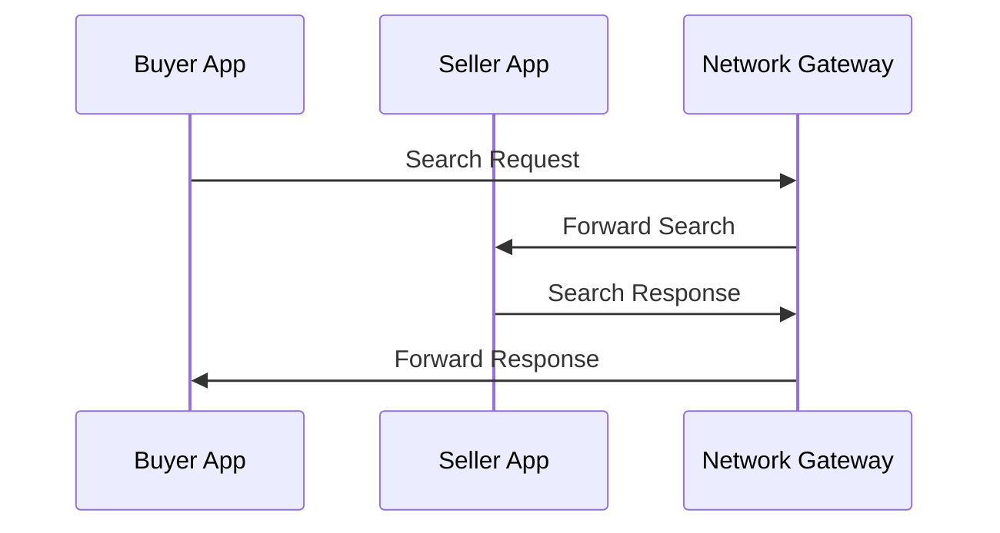

# RFC: [Title]

**RFC Number:** [BECKN-XXXX]  
**Category:** Standards Track  
**Status:** Draft  
**Version:** 0.1.0  
**Date:** [YYYY-MM-DD]  
**Updated:** [YYYY-MM-DD]  
**Authors:** [Author Names]  
**Reviewers:** [Reviewer Names]  
**Supersedes:** [Previous RFC numbers, if any]  
**Keywords:** [Comma-separated keywords]  

## Copyright Notice
[Legal text as per RFC 7841/5378]

## Status of This Memo

## Abstract

[One paragraph summary of the RFC's purpose and key points. Should be clear, concise, and self-contained.]

## Table of Contents

1. [Introduction](#1-introduction)
2. [Conventions and Terminology](#2-conventions-and-terminology)
3. [Motivation and Use Cases](#3-motivation-and-use-cases)
4. [Technical Specification](#4-technical-specification)
5. [Implementation Guidelines](#5-implementation-guidelines)
6. [IANA Considerations](#6-iana-considerations)
7. [Examples](#7-examples)
8. [References](#8-references)
9. [Appendix](#9-appendix)

## 1. Introduction

### 1.1 Background

[Provide context and motivation for the RFC. Explain the current state of the protocol and why this change is needed.]

### 1.2 Problem Statement

[Clearly define the problem being solved. Be specific about the limitations or issues with the current approach.]

### 1.3 Goals and Non-Goals

**Goals:**
- [Specific, measurable goal 1]
- [Specific, measurable goal 2]
- [Specific, measurable goal 3]

**Non-Goals:**
- [What this RFC explicitly does not address]
- [Out of scope items]

### 1.4 Scope

[Define what is and isn't covered by this RFC. Be explicit about boundaries and limitations.]

### 1.5 Terminology

[Define any new terms or clarify existing terms used in this RFC]

## 2. Conventions and Terminology
[Keyword interpretation as per RFC 2119/8174]

## 3. Motivation and Use Cases

### 3.1 Business Motivation

[Explain why this RFC is needed from a business perspective. Include market needs, user requirements, and business value.]

### 3.2 Technical Motivation

[Describe the technical challenges and opportunities. Include performance, scalability, security, or interoperability considerations.]

### 3.3 Use Cases

[Provide detailed use cases with user stories. Include both happy path and edge cases.]

#### 3.3.1 Primary Use Case
[Describe the main use case with a complete user story]

#### 3.3.2 Secondary Use Cases
[Describe additional use cases]

### 3.4 Success Criteria

[Define how success will be measured. Include both qualitative and quantitative metrics.]

## 4. Technical Specification

### 4.1 Architecture Overview

[Provide a high-level architectural approach. Include diagrams if helpful.]

### 4.2 Data Models

[Define all new or modified data structures. Use JSON Schema format when possible.]

```json
{
  "type": "object",
  "properties": {
    "property_name": {
      "type": "string",
      "description": "Description of the property",
      "required": true
    }
  }
}
```

### 4.3 API Specifications

[Define all new or modified APIs. Include request/response schemas and examples.]

#### 4.3.1 [API Name]

**Endpoint:** `[HTTP_METHOD] /[endpoint_path]`

**Description:** [Brief description of what this API does]

**Request Schema:**
```json
{
  "context": {
    "domain": "domain-name",
    "action": "action-name",
    "version": "1.1.0"
  },
  "message": {
    // Request message structure
  }
}
```

**Response Schema:**
```json
{
  "context": {
    "domain": "domain-name",
    "action": "on_action-name",
    "version": "1.1.0"
  },
  "message": {
    // Response message structure
  }
}
```

**Example Request:**
```json
{
  "context": {
    "domain": "retail",
    "action": "search",
    "version": "1.1.0",
    "bap_id": "buyer-app.example.com",
    "bap_uri": "https://buyer-app.example.com/beckn",
    "transaction_id": "TXN-001",
    "message_id": "MSG-001",
    "timestamp": "2025-01-15T10:00:00Z",
    "ttl": "PT30S"
  },
  "message": {
    "intent": {
      "descriptor": {
        "name": "Search for products"
      }
    }
  }
}
```

**Example Response:**
```json
{
  "context": {
    "domain": "retail",
    "action": "on_search",
    "version": "1.1.0",
    "bap_id": "buyer-app.example.com",
    "bap_uri": "https://buyer-app.example.com/beckn",
    "bpp_id": "seller-app.example.com",
    "bpp_uri": "https://seller-app.example.com/beckn",
    "transaction_id": "TXN-001",
    "message_id": "MSG-002",
    "timestamp": "2025-01-15T10:00:01Z",
    "ttl": "PT30S"
  },
  "message": {
    "catalog": {
      "providers": [
        {
          "id": "provider-001",
          "descriptor": {
            "name": "Example Store"
          },
          "items": [
            {
              "id": "item-001",
              "descriptor": {
                "name": "Example Product"
              }
            }
          ]
        }
      ]
    }
  }
}
```

### 4.4 Message Flows

[Describe the message flows using sequence diagrams or flow descriptions.]

#### 4.4.1 [Flow Name]

[Describe the flow step by step, including all participants and message exchanges.]



### 4.5 Error Handling

[Define error scenarios and handling mechanisms.]

#### 4.5.1 Error Codes

| Error Code | Description | HTTP Status | Recovery Action |
|------------|-------------|-------------|-----------------|
| 1001 | Invalid request format | 400 | Check request schema |
| 1002 | Missing required field | 400 | Include required field |
| 1003 | Authentication failed | 401 | Provide valid credentials |

#### 4.5.2 Error Response Format

```json
{
  "context": {
    "domain": "domain-name",
    "action": "on_action-name",
    "version": "1.1.0"
  },
  "error": {
    "code": "1001",
    "message": "Invalid request format",
    "path": "message.intent.descriptor.name"
  }
}
```

### 4.6 Security Considerations

[Address security implications and mitigations.]

#### 4.6.1 Authentication
[Describe authentication requirements]

#### 4.6.2 Authorization
[Describe authorization requirements]

#### 4.6.3 Data Protection
[Describe data protection measures]

#### 4.6.4 Privacy
[Describe privacy considerations]

### 4.7 Performance Considerations

[Address performance implications and optimizations.]

### 4.8 Backward Compatibility

[Describe how this change affects existing implementations.]

## 5. Implementation Guidelines

### 5.1 Prerequisites

[What needs to be in place before implementation]

### 5.2 Implementation Steps

[Step-by-step implementation guide]

1. **Step 1:** [Description]
2. **Step 2:** [Description]
3. **Step 3:** [Description]

### 5.3 Testing Requirements

[Testing scenarios and validation criteria]

#### 5.3.1 Unit Tests
[Required unit test scenarios]

#### 5.3.2 Integration Tests
[Required integration test scenarios]

#### 5.3.3 End-to-End Tests
[Required end-to-end test scenarios]

### 5.4 Migration Path

[How to migrate from existing implementations]

### 5.5 Deployment Considerations

[Deployment requirements and considerations]

## 6. IANA Considerations
[State actions or just add "This document has no IANA actions."]

## 7. Examples

### 7.1 Complete Examples

[Full working examples showing complete flows]

### 7.2 Reference Implementations

[Links to reference implementations]

## 8. References

### 8.1 Normative References
[Full working examples]

### 8.2 Informative References
[Links to reference implementations]

## 9. Appendix

### 9.1 Change Log

| Version | Date | Description |
|---------|------|-------------|
| 0.1.0 | [YYYY-MM-DD] | Initial draft |

### 9.2 Acknowledgments

[Contributors and reviewers]

### 9.3 Glossary

[Definitions of terms used in the RFC]

### 9.4 Open Issues

[Any unresolved issues or questions]

---

**Note:** This template should be customized based on the specific requirements of your RFC. Remove sections that are not applicable and add sections as needed. 